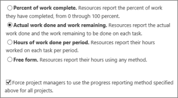

# Set up how time and task progress are captured

There are a couple of different ways you can set up Project Web App to capture task progress. [Step 3: Update progress](https://support.office.com/article/ca5c3826-85bf-4a31-9351-3b83fd7c8fe0)
  
When choosing the right settings for your organization, there are two different spots where you'll need to make changes. Start by going to **Settings** \> **PWA Settings**.
  
From there, some of the settings will be under **Timesheet Settings and Defaults**.
  

  
Other settings will be under **Task Settings and Display**.
  

  
|**Settings**|**Where to change them**|**What to change**|
|:-----|:-----|:-----|
|**Should team members enter time and task progress as hours in one view?**   |Timesheet Settings and Defaults    |Select the **Single Entry Mode** check box if you want timesheet hours to also be used as task progress.    |
|**Is task progress a percentage or a number of hours?**   |Task Settings and Display    | *If you are NOT using single entry mode,*  under **Tracking Method**, choose the default way that you want task progress reported: as a percentage, or as hours. If you choose hours, you have a couple of different options - one that includes remaining work, and one that is simply total hours worked.    You can also select the check box in this section to make it so that project managers are required to collect task progress using the method you choose. This helps maintain consistency across your organization, if that's important for tracking purposes.    |
   

