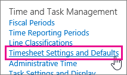
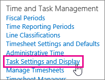
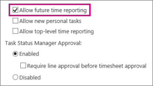
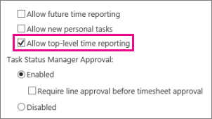
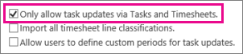
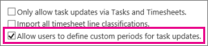

# Set up policies for capturing time and task progress

In addition to some of the standard settings available for time and task progress in Project Web App, there are also some more granular policies that let you fine-tune how your organization will work.
  
When choosing the right settings for your organization, there are two different spots where you'll need to make changes. Start by going to **Settings** \> **PWA Settings**.
  
From there, some of the settings will be under **Timesheet Settings and Defaults**.
  

  
Other settings will be under **Task Settings and Display**.
  

  
|**Policies**|**Where to set them**|**What to set**|
|:-----|:-----|:-----|
|**Can team members submit overtime and non-billable time?**   |Timesheet Settings and Defaults    |Under **Project Web App Display**, select the **The timesheet will use standard Overtime and Non-Billable time tracking** check box.    |
|**Got limits on how much time can be reported?**   |Timesheet Settings and Defaults    |Accounting systems, customers, or other internal factors may require that you have policies around how much time can be reported.    Under **Hourly Reporting Limits**, you can set **Maximum Hours per Timesheet**, **Minimum Hours per Timesheet**, and **Maximum Hours per Day**.    |
|**Can team members report work ahead of time?**   |Timesheet Settings and Defaults    |By default, team members can't submit actual work for future time periods. If your organization is okay with reporting hours before they actually happen, select the **Allow future time reporting** check box, under **Timesheet Policies**.    |
|**Can team members report time against top-level summary tasks?**   |Timesheet Settings and Defaults    | In Project Web App, tasks can be indented below other tasks, and the work done on the indented tasks will roll up to the top-level task to summarize all of the work done in that area. For example, your task list might look like this:     Produce white paper     Research subject     Write content     Review content     Incorporate feedback     Publish content     Typically, team members report work on the indented tasks, and those hours roll up to the top-level summary task ("Produce white paper"). However, in some organizations, it might make sense to allow team members to report time spent on the summary task, too.     If you want team members to be able to report time spent on summary tasks, select the **Allow top-level time reporting** check box, under **Timesheet Policies**.    |
|**Don't want project managers changing actual hours?**   |Task Settings and Display    |Under **Protect User Updates**, choose **Only allow task updates via Tasks and Timesheets**.    |
|**Want all types of work copied from timesheets to task progress?**   |Task Settings and Display    |Team members can import their timesheet hours into their task progress, to get a jump on filling out how much work they've finished. By default, only work that uses the [standard line classification](set-up-categories-for-timesheet-rows.md) (in the **Billing Category** column of a timesheet) will be imported.    If you want all work across all categories to be copied to task progress when a team member imports a timesheet, select the **Import all timesheet line classifications** check box, under **Protect User Updates**.    |
|**Can team members set the time frame for a task progress report?**   |Task Settings and Display    |Task progress is different from timesheets, in that it doesn't necessarily need to reflect a specific accounting period. If you want team members to be able to choose what dates they're reporting task progress for, select the **Allow users to define custom periods for task updates** check box, under **Protect User Updates**.    |
   

