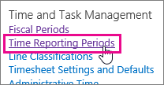
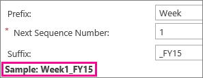

# Set up timesheets

|||
|:-----|:-----|
||Before your team members can start [Step 2: Turn in a timesheet](https://support.office.com/article/f49a8e4a-29d2-4601-ac5a-437c232c31f1), an administrator needs to set up a few things. Some things are required, and other options are there in case you want to go beyond the basics. |
   
## The easiest way to set things up

If you don't want to do a whole lot of work to get timesheets up and running, the only one thing you really *need*  to do is set up how often you want timesheets turned in. 
  
 **If you go with the default options when you set things up,** you'll end up with everything you need to have your team members turn in timesheets once a week for a year. Simple! The only thing you need to define is the start date for the first week, and Project Web App will take care of the rest. 
  
1. **Go to **PWA Settings**.**
    
  - In Project Web App, choose **Settings** \> **PWA Settings**.
    
  - Under **Time and Task Management**, choose **Time Reporting Periods**.
    
    
  
2. **Set a start date.**
    
    If you want timesheets turned in weekly, the only thing you need to change under **Define Bulk Period Parameters** is **Date the first period starts**.
    
    
  
    > [!TIP]
    > A best practice here is to set your first week to start on the first day of the week containing the first day of your [fiscal year](set-up-your-fiscal-year.md). For example, if your organization's fiscal year starts on Tuesday, July 1, it might make sense to have your first batch of timesheets start on the Sunday or Monday before that. 
  
3. **Set the format for period names.**
    
    Under **Define Batch Naming Convention**, you can leave things alone if you want and everything will work just fine. However, a lot of organizations prefer to add some structure to how each time reporting period is named.
    
    Without a **Prefix** or a **Suffix**, your time reporting periods will use simple incremental numbers (1, 2, 3, and so on). Team members will be able to turn in timesheets just fine with this basic naming.
    
    Adding some structure to the naming gives each reporting period some context. For example, you can set up reporting periods that are named "Week1_FY15," "Week2_FY15," and so on. This can be helpful if you need to refer to older timesheets.
    
    As you add a prefix and suffix, an example name is shown.
    
    
  
4. **Create periods and save.**
    
  - Choose **Create Bulk**.
    
    
  
  - Choose **Save**.
    
    
  
## Need your timesheets to do more?

If you find that the basic timesheets aren't capturing enough information, you can make them a little more substantial.
  
Here are some ways you can take things a bit further:
  
- [Add categories of work](set-up-categories-for-timesheet-rows.md) to capture different types of time, like research or development, or to capture bigger-picture efforts where your organization may be investing across multiple projects. 
    
- [Add non-project categories](set-up-vacation-sick-leave-and-other-non-project-work-categories.md) for time spent on other aspects of work, like training or travel. 
    
- [Set up your fiscal year](set-up-your-fiscal-year.md) so that you can map project work against your overall financial plans. 
    
There are also some [settings you may want to change](set-up-how-time-and-task-progress-are-captured.md) that affect how time and task progress is captured and handled in your organization. 
  

