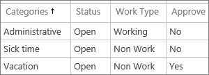
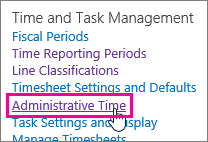
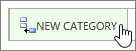
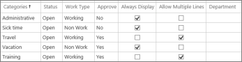
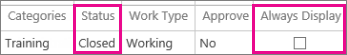

# Set up vacation, sick leave, and other non-project work categories

  
Timesheets can be used to capture all of a team member's hours during the week. In some cases, you may only be interested in capturing the hours spent on specific project tasks. In other cases, you may also want to include hours spent on other, non-project activities, like training, sick leave, or vacation.
  
Project Web App already has categories set up for sick leave, vacation, and general administrative time, but you may also want to create categories for things like training or travel.
  

  
To set up Project Web App to capture different categories of non-project hours, you can create administrative time categories. 
  
> [!TIP]
> Did you know that you can also [set up categories for task-related work](set-up-categories-for-timesheet-rows.md)? 
  
## Create an administrative time category to capture non-project work

1. In Project Web App, choose **Settings** \> **PWA Settings**.
    
2. Under **Time and Task Management**, choose **Administrative Time**.
    
    
  
3. Choose **New Category**.
    
    
  
4. Fill out the new blank row.
    
    
  
  - **Categories** Type a name for the new category. 
    
  - **Status** Choose whether the category is currently **Open** for use on timesheets, or **Closed**.
    
  - **Work Type** Choose whether the category captures Working time, like training or travel, or Non Work time, like vacation or sick leave. 
    
  - **Approve** Choose whether you want time reported in this category to require approval from a manager. 
    
  - **Always Display** Choose whether you want this category to be included as a row on every timesheet for every user, by default. This can help team members remember to report work on things that might be easy to forget, like sick leave or recurring non-project meetings. 
    
  - **Allow Multiple Lines** Choose whether you want team members to be able to include more than one row on a single timesheet for this category. For example you may want team members to be able to add a "Travel" category multiple times on a single timesheet, so that each "Travel" line can have a different description of where the team member went. 
    
  - **Department** If your organization has departments set up in Project Web App, you can choose which departments this category applies to. If you aren't using departments, don't worry about filling out this column. 
    
5. Choose **Save**.
    
    
  
## What if I don't want a category anymore?

If you want to make it so that an administrative time category is not longer available for team members to add to a timesheet, change the **Status** column for that category to **Closed**, and clear the check box in the **Always Display** column. 
  

  

