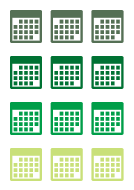
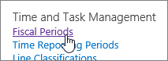
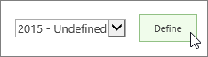
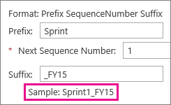
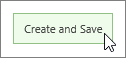
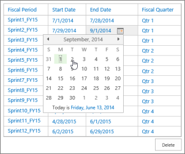

# Set up your fiscal year

  
|&nbsp;|&nbsp;|
|:-----|:-----|
||Most organizations have a fiscal year (FY) that is used to calculate finances on an annual basis. Within that fiscal year, there are typically quarters, months, or other periods used to evenly distribute financial plans. By setting up fiscal periods in Project Web App, you can map project work against your overall financial plans. |
   
 **What do I need to do?**
  
1. **Go to **PWA Settings**.**
    
  - In Project Web App, choose **Settings** \> **PWA Settings**.
    
  - Under **Time and Task Management**, choose **Fiscal Periods**.
    
    
  
2. **Set a start date.**
    
  - Under **Manage Fiscal Period**, choose a year, and then choose **Define**.
    
    
  
  - Under **Define Fiscal Period Start Date**, type or choose the first date of your fiscal year.
    
    
  
3. **Choose how you want periods set up.**
    
    Under **Set Fiscal Year Creation Model**, choose a method:
    
  - **Using quarters?** Choose one of the numbered methods ( **4,5,4**, **4,4,5**, or **5,4,4**).
    
    The numbers in these methods have to do with how many weeks you want in each fiscal period during each quarter. For example, here's what one quarter in the 4,5,4 Method looks like:
    
    
  
    If you choose the 4,5,4 Method, it will configure four quarters, with three fiscal periods in each quarter. The first period will be 4 weeks long, the second will be 5 weeks, and the third 4 weeks.
    
    A total of 12 fiscal periods will be set up for any of these numbered methods.
    
  - **Using months?** Choose **Standard calendar year** to create 12 periods that go from the first day of each month through the last day of each month. 
    
    Or, if you're thinking of months as 4-week increments, choose **13 Months**. With this option, a total of 13 fiscal periods will be set up.
    
  - **None of these work for me.** Choose whichever one is closest to how your organization works, and you can go back and refine things after you've saved. 
    
4. **Set the format for period names.**
    
    Under **Define Period Naming Convention**, you can leave things alone if you want and everything will work just fine. However, a lot of organizations prefer to add some structure to how each fiscal period is named.
    
    Without a **Prefix** or a **Suffix**, your fiscal periods will use simple incremental numbers (1, 2, 3, and so on).
    
    Adding some structure to the naming gives each period some context. For example, you can set up fiscal periods that are named "Sprint1_FY15," "Sprint2_FY15," and so on. This can be helpful for reporting because it provides a little more information about what's being captured.
    
    As you add a prefix and suffix, an example name is shown.
    
    
  
5. **Choose **Create and Save**.**
    
    
  
    After saving, you can change the information or delete rows in the table to refine your fiscal year.
    
    
  
|&nbsp;|
|:-----|
||
   
## What else can I do?

While you're getting set up, here are some other things you might want to do:
  
- [Set up timesheets](set-up-timesheets.md) to capture the actual time that team members spend working on tasks. 
    
- [Add categories of work](set-up-categories-for-timesheet-rows.md) to capture different types of time, like research or development, or to capture bigger-picture efforts where your organization may be investing across multiple projects. 
    
- [Add non-project categories](set-up-vacation-sick-leave-and-other-non-project-work-categories.md) for time spent on other aspects of work, like training or travel. 
    
- [Change other settings](set-up-how-time-and-task-progress-are-captured.md) that affect how time and task progress is captured and handled in your organization. 
    
|&nbsp;|
|:-----|
||
   

