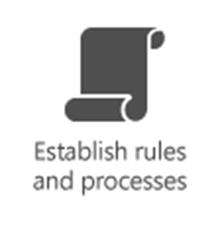
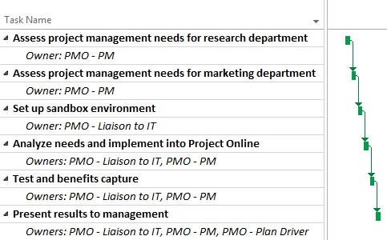

# Supporting your Project Online adoption with a Project Management Office (PMO)

  
## What is a PMO?

So you're planning to adopt Project Online into your business. How are you are planning to use it, or a better way of putting it, what's the business problem you are trying to solve? Some of the examples might be:
  
- My executives want better visibility into project status.
    
- I need a better way of managing my resources and assigning them to projects.
    
- I want to easily track the time people are spending on their tasks.
    
- I want more robust way to track project data than using Excel spreadsheets.
    
Organizations who have been most successful with using Project Online in addressing business problems such as these are the ones that create a set of standards, processes, and best practices for the way that projects are managed in their organization. The person or group that creates and manages these rules of project management is sometimes referred to as the Project Management Office (PMO).
  
## What does a PMO do?

In larger companies, a PMO can consist of a department that deals with project management issues across the organization, such as project management governance, implementation, training, researching project management needs, or determining the best way to build useful reports. In small or medium businesses, a PMO can range from a single person to a small group of people, but can also scale to try to address the same issues as in large businesses. The common goals of all PMOs, however, would include:
  
- Driving and evangelizing the project management system adoption.
    
- Simplifying project management for the organization's users by automating processes into the tool.
    
- Creating policies, procedures and best practices around project management functions.
    
- Being the project management subject matter experts by serving as a 'Center of Excellence' for all things project management, and providing training on project management best practices and tools.
    
- Being empowered by executive sponsorship to make and enforce change through their recommendations.
    
Still confused? Let's take a step back and use an example that people can relate to - how a head of household might take care of their own family:
  
|**Need**  |**PMO**  |**Family**  |
|:-----|:-----|:-----|
||The PMO helps to establish an efficient way to deliver information to project stakeholders through project status and health reports. This might involve researching reporting needs, moving required data to the system, and establishing workflows to ensure that the data required for recurring reports makes it to the system in time.    | The heads of the household will need information on how things are going:     -Quarterly reports on children's studies.     -Monthly bank statements to show the status of finances.     -Yearly doctor visits to determine family member's health.    |
||The PMO creates processes to get the right data to the project management system to provide status at a project level to project managers. It also provides guidance and best practices for resource management.    | People in the family will need to know who's doing what. This can include:     -Who will pick up children from school today, walk the dog in the evenings, cook dinner, etc.     -If someone can't do their usual task, you need to know who is available to take their place.     It helps to show everyone's work and school schedule, and availability, on a central family calendar. This way it is easy to know who can be scheduled for what.    |
||The PMO helps to create project collaboration sites and customize them to best suit the needs of the site users.    | Family members will need a forum in which they can collaborate, such as:    -Posting important events on a wall calendar in the kitchen     -Talking to each other daily at the dinner table.    |
||The PMO is responsible for setting up a system to handle risk management.    | Heads of the household might need to plan to reduce risk:     -Determine insurance needs for health.     Purchase a health club membership.    - Increase the amount they are saving for retirement.    |
||The PMO looks at current processes and workflows, and finds a method of automating them through the project management tool being implemented. One of these might involve determining drivers for selecting which projects to move forward on given a set budget (portfolio analysis).    | Heads of household will establish rules and processes for the family, such as:     -Set children's curfew or sleep hours     -Look at factors to determine which purchases to make (for example, "Should we buy a car, fix the roof, or go on vacation this year?").    -Set up lawn sprinklers on an automatic timer.     -Pick a time of week for the grocery shopping and errands.    |
   
A PMO drives a company to more efficient project management by doing things such as:
  
- Gathering information to help define what the project management requirements are for the organization. For example, analyzing your organizations business needs, designing processes to address those needs, and then mapping those processes to settings or workflows in Project Online.
    
- Determining what data is important to review on an ongoing basis, and working with the Project administrator to share that data with stakeholders. For example, determining the data required and the process to get the data into the system to create a weekly project status report to provide stakeholders with a roll-up of the health of in-progress projects.
    
- Creating rules for processes and workflows. For example, establishing a workflow where project ideas go through an approval process to become projects in Project Online.
    
- Migrating existing data from your current project management system into a new one. For example, finding the easiest way to migrate resource and project data from Microsoft Excel spreadsheets to Project Online, or from Project Professional on each person's computer to a centralized Project Online environment.
    
- Providing project portfolio management support to help with project prioritization and forecasting. Like most companies, there are many projects you'd like to do, but have limited budget and resources to do all of them. You need a way to determine which projects that you should move on. PMOs can drive the project and program selection process to ensure that future investments are in alignment with the organization's strategic goals and growth vision.
    
- Managing the emotional changes users might face in moving from their current project management system to which they are attached. For example, tactfully influencing project managers to move from their old process of saving their project files to their hard drives and sharing them out by showing them the advantages of publishing them to Project Online. The PMO might do this by devoting more time to convincing the more senior project managers first, and hoping their influence on the other project managers helps to drive the change.
    
- Managing the technical challenges of change by offering great training options.
    
## Why do I need a PMO?

In the family example, the consequences of not addressing some of the needs can be dire. For example, not reviewing a child's report card when it first arrives might result in the assumption that things are fine, when actually more study time or a tutor might be needed. In the same way, deploying Project Online without creating an entity to help with standardization and adoption can also have dire circumstances. Establishing a PMO will help to increase the chances of success for your Project Online deployment. Depending on your goals, this can translate to better efficiency in project management (for example, more projects completed on time), which is usually associated with lower costs to manage projects (for example, more project completed at or under budget).
  
## What are the first steps in creating a PMO?

The first steps in creating a PMO probably have already happened if you made an effort to find this article. If you are interested in moving to Project Online, you more than likely already have an idea of how it might improve efficiency or solve a problem in your company. In creating a path to formalizing your PMO, you should consider the following:
  
### Define what do you want your PMO to do

Is the main goal of your PMO going to be to address a specific business problem? For example, you might want to implement a timesheet system to get tighter control of costs analysis. Or you might have your project data spread across two or even three different applications, and want to consolidate the data into a single system, which would help to provide better insight into the execution of projects. Or it might be to provide ongoing project management guidance, and address project manager training needs. Once you understand why your PMO is needed, it will be much easier to scope what the requirements are in establishing and maintaining it.
  
### Obtain executive sponsorship

Make sure someone up high supports you. It is important that your PMO has executive sponsorship, as lack of executive support is one of the main reasons PMOs fail. If you already have an executive who know the benefits and importance of what you are trying to do, great! If not, one of the best ways to get them on your side is to show them the benefits of moving to a project management system like Project Online. You can do this by showing them the business problem that will be solved. You may have already done this to a degree when you were first evaluating Project Online, but you can really find allies in the executive ranks if you are able to show them how it works with your own data in a pilot environment. Benefit capture is essential in obtaining executive sponsorship.
  
Strong executive sponsorship can be helpful in addressing resistance users might have in moving from what they are familiar with, to a new project management system, such as Project Online. Evangelizing and promoting the benefits to other influential stakeholders, such as senior project managers, can also help in breaking any emotional attachments that other users might have to the system you are moving from.
  
### Build your team

Whether you are trying to establish a PMO in a large or small company, the following are responsibilities that need to be addressed by the roles in your PMO:
  
|**Role**  |**Description**  |
|:-----|:-----|
|Drive the Project Online adoption plan    |If you are in the process of implementing Project Online, the overall plan needs someone to drive it. Just like any project, the adoption plan needs an owner to ensure that the required tasks are staffed and completed.    |
|Research project management needs    |This person will assess the project management requirements of your organization. This person will need to talk with users throughout the company and across departments to find out how they currently manage projects, what their requirements will be, and how these might be improved through the implementation of Project Online. These requirements will need to be expressed to the Project administrator so that they can be properly implemented into Project Online. This person must have good project management skills, but should also be someone who is a good communicator. It is quite possible that people in the company may be emotionally attached to the process you are trying to move them from, so this person will need to be able to deal with this by showing how the new system will make life easier for them.    |
|Training, documentation, and support    |This person will need to assess the skill level of the users, and will be responsible for providing the training resources needed to use the product successfully. This might include creating role-based training for Project administrators, project managers, team leads, and team members. While most of your effort might be in putting together training for project managers or administrators, team leads and team members might find quick reference cards, cheat sheets, checklists or short tutorials to be the most effective. You will also need to find a way to provide in-house support for your users, and a method to escalate more complicated issues through the proper routes.    |
|Liaison to IT-department    | Collaboration with your IT department is essential in engaging them to assist in the sign up, setup, and configuration of Project Online. If you are only in the process of evaluating Project Online, this can typically be done by someone from your IT department without too much trouble by looking at the [Get started with Project Online](./get-started-with-project-online.md) documentation.     The PMO will need to work with your IT department to address these two areas:     -Office 365 administration: The PMO will need to work with the Office 365 administrator for assigning users and licenses.     -Project Online administration: The PMO will also need to work with a Project Online administrator on things such as custom fields, resources, and timesheet configuration. They might also need to work with the PMO to implement processes into Project Online through workflows.    |
   
Some PMOs in larger companies also have project managers that can be assigned to help provide direction to specific projects requiring assistance. This can range from advising the project owner, to actually taking over ownership, given the scope of the project.
  
### Create a mission statement for your PMO

All PMOs should have a mission statement. If you have already assessed the need for your PMO, this will be much easier to create. Look at your company's existing mission statement, and try to create one that aligns with it as well. It does not need to be overly complex, but just enough to provide all a basic understanding of why the PMO exists and what its role is in your company.
  
### Create a plan to build your PMO

After scoping out the tasks you need to build your PMO, you might want to create a high-level project plan for it. Consider the building of your PMO as one big project, with associated tasks, durations, and assignments. Your project plan will become more defined as you step through some of the initial tasks, such as assessing your environment. The project plan helps to give your PMO a build schedule to keep track of what you have done, what you are working on, and what you have yet to do in creating your PMO. For example, here are how several PMO build tasks in a Project Online project plan might look:
  

  
### Learn more about PMOs

If you do not already have a PMO, you may be intimidated a bit at the thought of starting one. Although your company's needs and requirements will drive your PMO, you need to learn how to create the framework to establish and evolve your PMO. Depending on your goals, you might want to research the various PMO process and industry methodologies, or see which PMO model you might closely align with. There are many books, training, and online resources available about creating and managing PMOs that can help you in your efforts.
  
If you are trying to set up a PMO and need assistance, you may want to contact a Microsoft Certified Partner or Microsoft Consulting Services. We also have in-house consultants at Microsoft with excellent experience at setting up PMOs for small, medium, and large companies.
  
## What now?

So, are you ready to start your PMO? Hopefully, you've realized after reading this article that starting a PMO is an investment that will be well worth the time and effort. It will require a lot of collaboration with people in your company, and having an executive "champion" is essential. It will also require an investment in researching more about setting up a PMO through the many resources that are available. And if you need help, you can turn to Microsoft Certified Partners as well as Microsoft Consulting Services.
  
If you are in a smaller company, the scope of all of this may seem overwhelming. You may not have the resources to hire people for each PMO role noted in the "Build your team" table, and you don't need to. Just be aware that these are responsibilities that will likely need to be addressed at some point in time, and to a degree that suits your requirements. Also note that the effort needed can scale to your company size and goals. A PMO in a smaller company might only need to meet with a few senior project managers in their company to assess their needs, versus multiple departments with varied requirements in a larger company.
  
Establishing a PMO can help drive your Project Online success, and using Project Online can drive your PMO success. Good luck in your implementation!
