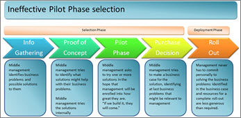
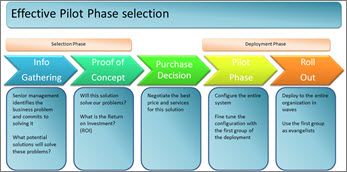

# The challenges of selecting enterprise software

This article is part of our "From the Trenches" collection. It describes how enterprise system implementations need to able to adapt and evolve to be successful. 
  
To download the Word version of this article, see [The Challenges of Selecting Enterprise Software](https://go.microsoft.com/fwlink/?LinkId=208380).
  
To see more articles, see ["From the Trenches" white papers](https://support.office.com/article/faec6b1a-c217-4c79-b8c4-0514f402106b).
  
## The Challenges of Selecting Enterprise Software

It happens around here all the time. A client sends a "Request for Proposal" (RFP) to the office with instructions to complete a response in a few days or week and send it back to have our enterprise system considered for purchase. RFPs pretty much all look the same. There's usually a brief overview, instructions on what you need to do to have your response be considered, including how it needs to be formatted and when to send it back, etc. Then there's a long grid of features that are required and a number of additional essay questions to write answers to.
  
The challenge with RFPs is that they weren't ideally suited for selecting enterprise software, and what ensues when an RFP process is followed doesn't guarantee the best decisions for the organization. RFPs were designed by the purchasing community as a way to get the best commodity at the best price and they still do a great job of that. When the offerings are comparable, then the decision-making process can focus on the best price with only one or two additional variables (such as shipping dates) to contend with. When the possible solutions are in the same general category but not at all comparable (as is the case with enterprise software), then the number of variables that must be considered by purchasers is huge and the RFP process doesn't add value to the selection. How most companies select enterprise software Let's start by looking at the process that happens all the time in any vendor or solutions provider of enterprise software. I'll be talking about enterprise project management software or enterprise timesheet software as that's what my firm provides, but the paradigm is the same for virtually any enterprise system selection.
  
### How most companies select enterprise software

Let's start by looking at the process that happens all the time in any vendor or solutions provider of enterprise software. I'll be talking about enterprise project management software or enterprise timesheet software as that's what my firm provides, but the paradigm is the same for virtually any enterprise system selection.
  
In most organizations, the impetus to look for enterprise software comes from some problem. Perhaps the problem is surfaced by the field personnel. Perhaps the problem is identified by someone in senior management. However it happens, the initiative has to get support from someone in senior management. Grassroots selection of a system that will affect the entire enterprise is a fantasy in even the most progressive organizations. So a senior manager decides, "we need this kind of enterprise system." 
  
The typical enterprise software selection process goes like this:
  
1. Management says we need a new enterprise system
    
2. Project manager is selected
    
3. Solicit requests from all departments involved
    
4. Merge all requests into one large spreadsheet
    
5. Send the requirements grid to lots of vendors
    
6. Get lots of responses
    
7. Short list
    
8. Watch demonstrations
    
9. Negotiate
    
10. Get management acceptance
    
11. Have management decide on something else
    
A project manager for the selection effort is volunteered. He or she does what we all do —go to the Internet, load up a search engine and type in "EPM Software" (or whatever enterprise system is desired). Immediately a half-million hits are returned. Perhaps the diligent project manager surfs the first dozen or so to learn what kind of systems might be available before moving on. Clearly no one has the time to surf through a half-million or more hits to see if perhaps the very last one is the ideal system for the organization.
  
Undaunted, the project manager now assembles a selection committee from among those who will be affected by the implementation of this new enterprise system. Some of those on the committee may be from among field personnel who identified the need in the organization in the first place. Others may not. There may be a mix of people on this selection committee who have diverse interests in what kind of system will be selected. 
  
The hapless project manager now solicits each member of the committee to poll their representative group for what they require in the new enterprise system. How does each committee representative do this? Well, first of all, not everyone puts in the same effort but for those who do their homework, they ask their staff to submit a list of features that they would find important. Then they, too, hit the Internet and surf some vendor Web sites. They can copy and paste from features they see in the brochures of these sites as each site gives them new ideas of what kinds of requests they might be able to make of a new system.
  
Now the committee is reassembled and the long spreadsheet of each committee member is merged with the others into one massive spreadsheet. The mega-spreadsheet of requirements is categorized, but there are challenges. First of all the diverse needs of the committee now become more apparent as features are requested from a wide range of perspectives. There may be committee members in different departments but also in different countries or even different divisions. There is almost always a request which is at conflict with another request in the same list (e.g., the system should be very easy and not have many prompts and the system should be very flexible with a large number of options for each user).
  
Finally the combined spreadsheet that the vendors will see is complete. It has hundreds of feature requests and for each one the vendor will be expected to say "Yes", "No" or "Yes with some effort". A weighting system may also be attached to say whether this feature is a "Must-have", an "Important-to-have" or a "Nice-to-have". 
  

  
The RFP is almost ready to go. There will be a few essay questions, usually about the technical architecture of the selection and, depending on how many people were polled about these requirements, the architecture requests can be equally conflicted (e.g. The system must have all data stored centrally in the SQL Server database ¬and¬ the system must allow any data to be stored locally on the user's computer).
  
Actually, it's sounding pretty good so far, don't you think? After all, we're going to get back a bunch of vendor responses that show who can deliver all the features that we'll need. Actually, it's sounding pretty good so far, don't you think? After all, we're going to get back a bunch of vendor responses that show who can deliver all the features that we'll need.
  
But there's actually a fundamental problem with what I've described thus far: A problem that doesn't occur when we're using the RFP process for a commodity rather than an enterprise system. It's this: An enterprise system is a solution to something. But we've said nothing so far about the problem. This is such a common occurrence that the technology industry has come to accept it as normal and acceptable.
  
### Why selecting enterprise software that way doesn't work

Purchasers have been using this method for decades and no one questions it, but people in the enterprise software business know there is a fundamental problem with the classic RFP method of selecting enterprise software.
  
First of all, just because you have an enormously long list of features, it does not necessarily mean that you are any closer to solving a business problem. In fact, if you haven't even articulated what specific business problems you are trying to solve, then you are likely to make things more complex and ultimately worse, not better. The RFP process was designed to purchase commodities. When we've got homogeneous products like shoes or potatoes or sugar, then purchasing these items in this way can result in the lowest-cost bidder and the best selection from among the possible suppliers. The responses to an RFP for a similar commodity makes comparing possible suppliers very easy. When the variables for each product in the mix are infinite (as they are with enterprise software) then the responses to the RFP have an infinite number of variables also and the process yields results that have little value.
  
When we use the RFP method of selecting enterprise systems, the RFPs mostly all look the same. This is because they are all created in response to the same stimulus. The project manager requests a list of 'what you will need in this enterprise system' and the only vocabulary most middle managers have to respond to that request is a list of features. Consequently, the responses to RFPs all look the same. They're a checklist of all the features available either as part of the system or as part of the system with some effort. 
  
What is most common for selection teams is that they will receive a number of responses to their RFPs, they'll wade through the hundreds of pages and, when they're finished, they won't feel any closer to a solution than when they started. This is terribly frustrating for purchasers who put in enormous effort in creating what should be a fair request for proposal and in evaluating the answers only to find that the exercise was for naught.
  
Worse than all of this is that experienced enterprise salespeople know the process will yield frustrating results and are at work from the moment they hear there will be an RFP created. They're not working on the RFP response. That's not relevant. Instead, they are working two or three levels higher in the management structure, looking for the original impetus that got the RFP started. They look for the senior executive who articulated some business challenge and set the wheels in motion so that purchasers and other middle-management staff would ultimately create the RFP and send it out to vendors. 
  
When the RFP responses end up without a clear answer to the business problems that are almost never articulated within the purchasing process, the enterprise salesperson is ready to leap into action, having a senior executive bypass the process altogether and select a system based on their own personal relationship with the senior enterprise salesperson. 
  
If you think this sounds jaded, you're wrong. In fact, you can make a better case for having software selected through personal relationships at the executive level than you can for buying through the RFP process.
  
### But what about a Proof of Concept or Pilot?

So, we know the classic purchasing process is flawed when we apply it to the purchase of enterprise software. If that's the case, how should we choose enterprise software such as an enterprise project management system? A popular method is to use the Proof of Concept or Pilot Phase method. 
  
These two terms are often used synonymously, so let's start off by talking about what is a Proof of Concept or a Pilot deployment.
  
> **Proof of Concept**. In a Proof of Concept, the prospective organization deploys the enterprise software in a limited fashion in order to prove that it can accomplish a technical challenge where there is some question as to the solution's ability to overcome that challenge. An example might be for data volume. "We're concerned that the product might not be able to handle as many tasks as we have per project. We'd like you to come with the software, take two or three example projects with 500 tasks each and show us how these can be loaded into to the software and that the software can still perform its basic functions with this volume in it."
    
> **Pilot Phase**. A Pilot Phase is an installation of the enterprise software but with a limited scope. A pilot deployment might be for a subset of users; for example only 10 out of 1000 people will use the software fully for a four-week period. Or, it might be for a subsection of the functionality or a subset of the volume of data; for example only 10 out of 500 projects will be loaded.
    
> **How is the Proof of Concept or Pilot Phase used?** The problem that is often encountered is how the Pilot Phase or Proof of Concept is applied. It is quite rare when a prospective organization calls and asks us for a Proof of Concept proposal and can also identify what technical concept needs to be proven. "What are you hoping to prove and how will we be able to measure that we've proven it?" we ask. 
    
What is most common is that someone in middle management has identified a piece of enterprise software that they hope will make their lives easier in their organization. Senior management is not at all involved, and the middle management staff have not even articulated what business challenges they are trying to overcome. It is their hope that if the solution was just in the building, that the next time someone from management would wander down the corridor, they would 'accidentally' see the solution in operation and would instantly give their blessing to an enterprise deployment. To borrow a phrase from the movie Field of Dreams, "If we build it, they will come."
  

  
It is rarely successful. The problem with enterprise software is that we need senior management's involvement to make the deployment a success. It is senior management who will be the 'clients' of the reports and analysis from this enterprise system. It is senior management who will need to invest personally to allow a range of staff the time required to design, configure and be trained in the enterprise software. It is senior management who will have to accept or even help redesign the business processes that are part of any enterprise system deployment. Without senior management giving not just their blessing but also their implicit support and direct assistance, no proof of concept will help.
  
This is true also for a pilot phase. If the company has not committed from the highest level to solving some business problem through the use of enterprise software, then the introduction of a pilot phase is not productive. 
  

  
This is not to say that pilot phases of a deployment have no place. They do carry a critical spot in a successful deployment. That place is immediately after the purchase decision is complete and the design of the enterprise system has been concluded. Now a pilot phase makes a great place to test out our enterprise system design and fine tune it for general deployment.
  
When a pilot phase is done in the hope that seeing the software in action will result in management selecting it, then we have an ineffective Pilot and will get no further ahead in the selection process.
  
### How should organizations select enterprise software?

Enterprise systems are purchased by middle- to large-sized organizations every day and, while the RFP method may not be the most effective, there are several methods of selecting enterprise software that are very effective. Here are a few tips for creating your own effective enterprise selection process.
  
- **Articulate the Problem**. First and foremost, articulate the problem. This means that senior management must be involved and the problem to articulate is a business problem so it should be articulated in business terms. One good question to ask is, "What business decision can we not make now or can we make only with great difficulty, the making of which could be eased with the deployment of this enterprise system solution?"
    
    There may be a series of business challenges that you wish to solve with the use of this enterprise system.
    
- **Give vendors some latitude to create the solution**. Once the business problem or problems have been articulated, contact possible vendors and make sure the access to the senior management who assisted in the process is transparent. "Secret" vendor meetings with senior management become impossible when management is part of the process from the beginning. Let the vendors understand the problem and give them some latitude in answering it. You may find out more about your organization in explaining how these business challenges affect you than you realize and you will certainly see a much wider range of possible solutions to your problem when you don't try to describe the solution to the potential vendors.
    
    When you talk to possible solution providers, make sure they understand that they must speak to both the technology and the business process challenge. There has never been an enterprise system solution that didn't have some impact on the organization's process. If the solution provider can't help with how the process will be affected, then you're only looking at part of the solution.
    
- **Go meet some people**. When you get down to a couple of possible solution providers, ask to talk to some of their existing clients. Even better, see if the vendor will let you go visit some of their existing clients. Good solution providers often have clients who have had success in their own deployments and who are generous enough to make time to meet prospective clients.
    
    You'll learn more from a couple of hours with an experienced client of the possible solution than you would have ever learned from reading RFP responses or looking at vendor sales demonstrations. When you ask the vendor for possible client references and site visits, you might think the ideal company to meet would be one exactly like yours. That's not always the case.
    
 It's often extremely valuable to meet companies in other industries that are related or somewhat similar to yours. You might also learn lots from organizations who are bigger or smaller than you are. Place more emphasis on how much experience the organization has had with the solution rather than what version they're using or whether they're of the exact size or in the exact industry you're in. 
  
If you are lucky enough to visit an existing client, remember that it's not the vendor. Be respectful and courteous and thankful. Bringing a small gift, perhaps of company logo promotional material is often well appreciated. While you're with the organization or while talking to references on the phone, some possible questions might include:
  
1. What process did you use to select this solution over others?
    
2. What impact has this solution had on your business processes?
    
3. What was the most challenging aspect of the deployment?
    
4. What was the most valuable return on investment thus far?
    
5. How do you see the solution evolving from here?
    
Don't expect only happy answers. 
  
A vendor who is completely unable to provide references has to be somewhat more suspect than one who has a number of satisfied clients.
  
Finally, when you've made your selection, deploy in phases. You can find other articles in this column on how to deploy in a phased vs. big-bang mode. This will mitigate the risks involved in any enterprise system deployment and help fine-tune the deployment process as the system evolves.
  
Remember that any enterprise system deployment is a dynamic process. It's not a one-time decision with happy results arriving month after month forevermore. The most successful enterprise deployments start with a selection that involves the key personnel who will be a part of the deployment process from the most senior in management to the most tactical in the field and continue through the evolution of the system in phase after phase. 
  
An effective enterprise system selection is only the first phase of the process. 
  
## About the Author

Chris Vandersluis is the president and founder of Montreal, Canada-based HMS Software, a Microsoft Certified Partner. He has an economics degree from McGill University and over 30 years experience in the automation of project control systems. He is a long-standing member of the Project Management Institute (PMI) and helped found the Montreal, Toronto, and Quebec chapters of the Microsoft Project Users Group (MPUG). Publications for which Chris has written include Fortune, Heavy Construction News, Computing Canada magazine, and PMI's PMNetwork, and he is a regular columnist for Project Times. He teaches Advanced Project Management at McGill University and often speaks at project management association functions across North America and around the world. HMS Software is the publisher of the TimeControl project-oriented timekeeping system and has been a Microsoft Project Solution Partner since 1995. 
  
Chris Vandersluis can be contacted by e-mail at: chris.vandersluis@hms.ca
  
If you would like to read more EPM-related articles by Chris Vandersluis, see HMS's EPM Guidance site (https://www.epmguidance.com/?page_id=39).
  

