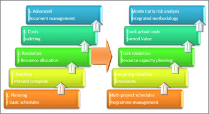
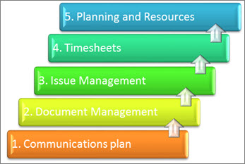

# The project management system maturity model

This article is part of our "From the Trenches" collection. It describes how as organizations mature, they can be more effective in the use of their project management systems. It describes how it might be more effective for companies to elect to use only certain aspects of a new project management system to a level with which they are comfortable, even though they are tempted to use every feature that is available to them. As the company continues to mature, it can become more advanced in its use of the features that it needs to use. 
  
To see more articles, see ["From the Trenches" white papers](https://support.office.com/article/faec6b1a-c217-4c79-b8c4-0514f402106b).
  
## The Project Management System Maturity Model

The Project Management Maturity (PMM) model is a pretty hot topic these days. There are waves of consultants who are making a good living helping organizations assess their "project maturity level" which is pretty much always displayed hierarchically with more mature always shown as being better than less mature. Proponents of the concept say the PMM model shows the capabilities of an organization to manage projects. There's a whole conversation to be had about how organizations become more effective and I'm not sure just climbing the Project Management Maturity model necessarily gets you there. But that is a subject for another day. Whether or not you're a fan of the PMM model, there is another kind of maturity model that I've seen with organizations who use Project Management systems.
  
When we work with organizations who are deploying a project management system, it's very common to find that the desire of organization is to reap the benefits of every single element of the new system they've just had demonstrated by the vendor. The client sees reports and screens and workflows and functions that they've only ever dreamed of and they imagine a world where all that functionality works as smoothly in their organization as it does in the sales demonstration. It is usually unclear to the client that the demonstration data and demonstration configuration that is being demonstrated was carefully developed in order to showcase as much of the product as possible. In the case of Microsoft Project and Project Server, this may extend far beyond the single product to include the entire stack of technology.
  
The client sees screens that initiate from Windows SharePoint Services or from Microsoft Office SharePoint Server forms. They see functionality that touches Active Directory or SQL Server Reporting Services. They might see workflow from BizTalk Server or Windows Workflow Foundation and displays that come from PerformancePoint. The flow of data might follow a storyboard or a use-case scenario that makes understanding the potential benefits easy but understanding the underlying technology more difficult.
  
When we arrive to actually deliver the functionality the client is interested in, we need to temper their desires to deploy everything at once with a reality check. The client needs to decide how it wants to do business before we can even consider configuring such functionality and whether it can be delivered out of the box, with configuration or with customization effort. There are some clients who are insistent that they deploy every aspect of the functionality they've envisaged and are prepared to dig in and do the design, training, learning and development of that solution as well as find the funding both in time and money to deploy it, but these organizations are the exception.
  
What is much more common is that the client elects to deploy the aspects of its new project management system to the level that it is already comfortable with. As the organization becomes more knowledgeable about both the system and the underlying business processes, it will demand more and more of the system; becoming more 'mature' as it progresses. It's a natural progression.
  
As the organization's understanding of a project management process that can be automated evolves, its demand for that automation evolves also. This natural progression is just like the Project Management or Capability Maturity models. Knowing that organizations will most likely evolve along these paths has made us very effective at knowing where to put our efforts in making an organization effective. We tend to focus on those project system areas that we know have a better chance of adoption and of giving a return on the investment given the project system's maturity of the organization. Of course no two organizations are the same, so chiseling this knowledge into a tablet isn't a good plan. It's just the most likely progression based on our experience with many companies.
  
In our experience, the natural evolution of use of a project management system comes in five basic areas, although the sequencing of them has shifted in recent years thanks in large part to technology. Let's talk about the five basic areas to start with, and I'll cover some of the new shifts that we've seen over the last few years nearer the end of this article. 
  

  
> **1 - Planning**. We almost always see Planning as the first wave. Some organizations never get beyond this. They make a basic schedule, bronze the GANTT chart, and then mount it on the wall of the project team's office. People refer to the plaque from time to time nostalgically as they remember the fine state of their schedule just before the project started.     While I'm being a bit cruel at those who are only using their expensive project management software to make a bar chart, there is certainly value from doing so. Creating an organized schedule tends to make the project participants think about how the work should be put together and is much more effective than doing nothing or just making a spreadsheet list. 
    
> **2 - Tracking**. Next in line in our experience is typically tracking. An organization which is a little more "mature" in the use of their project management system will not only plan, they'll track their schedules, advancing them on a regular basis with the progress to date and even look forward with projected schedules as the plans advance. For many organizations, stopping here is effective. They're planning in their project management system, and then they're working the plan by updating it regularly and even giving useful reports to management.
    
> **3 - Resource Management**. Once planning and tracking are handled, organizations tend to look to the resource management problem and how it might get resolved by using the project management system. Resources can have many aspects, as I've discussed here before, but at the most basic level, resource allocation (assigning the work to resources) is a big step, followed by resource analysis of some kind.
    
> **4 - Cost Management**. Cost management is the fourth typical area and many organizations never get here. At a basic level, having a cost estimate broken down by phase or better yet by task in the project is a good costing start. Tracking the actual costs either by hours or by dollars is the next level. 
    
> **5 - Advanced**. I'll put a fifth area here for "Advanced" subjects for what might be a wide range of topics that I haven't put in the other categories so far. It's not that they're not important but that when you get to the fifth wave of evolution in an organization, it can go a lot of different ways. So, I'll put risk analysis, document management, and automated workflows in here. There are also advanced areas in each of the other four areas I've discussed so far. 
    
Each of the elements I've discussed so far could be extended further and often is as the organization's project maturity and the understanding of the automated aspect of its project management environment increases.
  
For Planning, the progression can go to multi-project integrated schedules with inter-project links or program management with sub-projects. 
  
For Tracking, the organization usually advances from simple percent complete progress, which is typically the lowest quality of tracking data, to remaining duration. Tracking might also extend to timesheets to give an exact value of hours worked against the original plan by person.
  
In the Resources area, we see going from just allocating the tasks to resources to tracking resource progress usually with a timesheet and then moving to the most requested aspect of EPM, Resource Capacity Planning. For some organizations, Critical Chain fits in here also, merging the resource and schedule information into one advanced algorithm.
  
For Costs, we usually go from the basic budgeting to tracking actual costs along with hours and time to get budget versus actual variance, and from there to Earned Value tracking, as is done in the Defense and Aerospace sectors.
  
Even the Advanced area has advanced topics. The most popular among these are Monte Carlo Risk Analysis and integrating project management methodology (particularly in the IT sector).
  

  
Most organizations progress with all five of the basic elements from the left side of the graphic above in the order that I've just described before turning to any of the advanced areas. Some find that their particular project management challenge means focusing on one element ahead of others. What is extremely difficult and rarely successful is trying to be more mature than you are. 
  
It's very common, for example, for an organization to desire Resource Capacity Planning, yet when you look at the skills and experience of the organization, you find that the building blocks of creating a resource capacity planning system are missing. I often use capacity planning as an example of why knowing where you are on the Project Management Systems Maturity model is so important. In my experience, this is the single most requested benefit from EPM systems and yet it is almost the last benefit I can deliver. This is because resource capacity planning requires so many other elements to work first. In order to deliver projected resource requirements versus availability we first need:
  
- Project plans we can count on
    
- Projects tracked with accurate progress
    
- All tasks to be allocated to resources
    
- Complete and accurate resource availability 
    
- All non-project work to be quantified and tracked
    
- Complete compliance by project managers and department managers on work completed, work projected, and changes in resources.
    
Whew! It's no small list, and the corporate culture required to comply with such an environment often requires change management on a big scale. So, we turn back to the Project Management Systems Maturity model and clients can make a roadmap of what they need to accomplish.
  
This is not an exhaustive list of course. We can easily make a third column and then a fourth, but I've not done so here because from this point the most common progression is less clear. Each organization's project management requirements will dictate the interest in moving forward in a particular area.
  
I promised earlier in the article to discuss something that has changed in the last few years. The model I've described above has stood up for quite some time, but in the last couple of years, movement in the IT industry has made a significant shift in another direction, and that has everything to do with collaboration.
  
At one time in the project management software industry we were very algorithm-centric. Everything stemmed from the critical path schedule, we thought. In the last few years, though, a few things have changed. First of all, the availability of people through the ubiquitous Internet or telephone technology has made it even easier to assemble and communicate with your project team. This has helped change who is on a project management team. While once we would have thought of project team members being people deep within the organization, working in a small windowless room with desks surrounding a massive plotter, now we think of project team members throughout the organization.
  
Team members include those doing the work, of course, but might also include the executive sponsor, the department resource managers, the users, the marketing department. It's now not at all uncommon to find that the project team extends not just beyond the building's walls but well outside the organization itself to include sub-contractors, prime-contractors and even the client. Sub-contractors may not be in the same time zone or even the same country/region. All of this has made communication a key success factor for projects in many different types of industries.
  
That has caused some organizations in industries like R&amp;D and IT, for example, to look at a Project Management Systems Maturity Model that progresses quite differently: 
  

  
The first element in these organizations is to create a communications plan, and that's almost always based on collaboration technology like SharePoint Server. These organizations find that from a centralized perspective they can get more benefit from getting their extended project management team to collaborate and communicate than from any centralized planning. The meteoric rise in popularity of SharePoint Server is a testament to how much pent up desire there is for getting people to work together. 
  
The progression from a basic communications plan then often goes to document management—one document of which might well be a project schedule. It's turning the classic enterprise project management progress on its head, but you can see for some organizations how attractive this might be. Get a handle on the contracts, documents, emails, meetings and other communication, and efficiency increases very quickly. Don't get a handle on communications, and the loss of efficiency might well be serious.
  
From document management, it's a short step to managing issues and doing change management—which for IT and R&amp;D means managing one of the most potentially damaging aspects of a project. 
  
Surprisingly, timesheets come next. In fact, sometimes timesheets come even earlier. When our organization first got started in the timesheet business with our TimeControl product, we were quite certain that organizations who needed a timesheet like ours were those that were already mature enough in their planning and tracking process to be able to take advantage of it. You can imagine our surprise to find that many organizations want to deploy an enterprise timesheet before they deploy an enterprise project management system. When you look at the change management challenge of each it becomes clear why. Most users will adopt a timesheet grudgingly but quickly. Getting a 1000-person organization to accept a centralized timesheet system takes a matter of weeks. Getting the same 1000 users to accept a centralized project management system can take from months to a couple of years. So, even though the centralized planning isn't established, the organization can still get tremendous benefit from centralized timesheet data.
  
Finally, these organizations turn their attention to the core project planning exercise. This is not to say they haven't been doing project scheduling so far but it won't have been highly centralized.
  
Just like the first Project Management Systems Maturity Model, each of these elements can carry advanced topics, too.
  
Communications plans often progress to more integrated communications systems, including instant messaging, email integration and more.
  
Document management often progress to workflow management and forms integration. 
  
Issue management usually evolves to management of lists of all kinds and an integrated change management process.
  
Timesheets evolve from task timesheets to links with Finance, Payroll, HR and ultimately links back to the enterprise project management system for auditable tracking data. 
  
Planning and Resource Management tend to evolve just like my classic Project Management Systems Maturity model.
  
There's no "right" way to advance in your use of your project management system, nor is there a "wrong" way. As I've said in these columns before, what is most important is that you look first at what you need to accomplish in order to be more effective as an organization and from there design the solution to that challenge. What is important is knowing you have the building blocks from the basic elements before you start building something more advanced. I'm often heard saying that we need Project Management 101 before we move to Project Management PhDs.
  
Remember that the use of a project management system is only one aspect of a possible solution and it's up to you to decide how "mature" you should be and in what areas in order to make the management of your projects more effective. 
  
## About the Author

Chris Vandersluis is the president and founder of Montreal, Canada-based HMS Software, a Microsoft Certified Partner. He has an economics degree from McGill University and over 30 years experience in the automation of project control systems. He is a long-standing member of the Project Management Institute (PMI) and helped found the Montreal, Toronto, and Quebec chapters of the Microsoft Project Users Group (MPUG). Publications for which Chris has written include Fortune, Heavy Construction News, Computing Canada magazine, and PMI's PMNetwork, and he is a regular columnist for Project Times. He teaches Advanced Project Management at McGill University and often speaks at project management association functions across North America and around the world. HMS Software is the publisher of the TimeControl project-oriented timekeeping system and has been a Microsoft Project Solution Partner since 1995. 
  
Chris Vandersluis can be contacted by e-mail at: chris.vandersluis@hms.ca
  
If you would like to read more EPM-related articles by Chris Vandersluis, see HMS's EPM Guidance site (https://www.epmguidance.com/?page_id=39).
  

