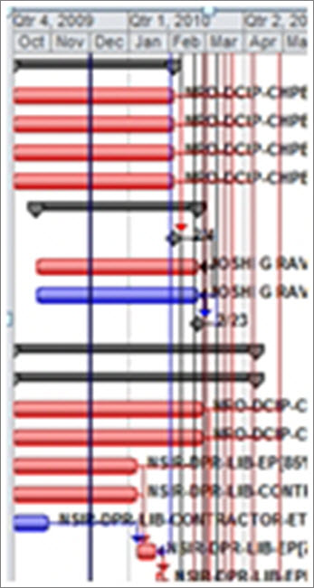
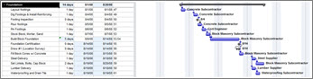

# The Seven Deadly Sins of Project Schedules: white paper

This white paper is part of our "From the trenches" collection.
  
This white paper discusses common mistakes that are made in project schedules and offers practical advice. It provides practical advice and recommendations that are relevant to any version of Microsoft Project.
  
To see more white papers, see ["From the Trenches" white papers](https://support.office.com/article/faec6b1a-c217-4c79-b8c4-0514f402106b).
  
## The Seven Deadly Sins of Project Schedules

Scheduling is never a simple component of a project; yet in the last 20 years, I've repeatedly run into the same basic problems in every organization I have worked for or consulted with regarding their schedules. Here I lay out the seven deadly sins of project schedules and provide you with some antidotes. My hope is that you'll use this advice to lay the right foundation for successful project management when using schedules.
  
### Sin #1: The schedule is too complex!

When you have schedule that has more lines running north to south than left to right, you have a problem. If it takes weeks or days for stakeholders to understand your schedule, then the model is too complex. If it's too difficult to explain to executives or even to your team, then how can you expect anyone to benefit from it?
  

  
How do you know if your project is too complex? Ask yourself how easy it is to find the critical path in your schedule.
  
### Sin #2: Your schedule has too many tasks

This, more than anything, will contribute to why schedules fall by the wayside. Project managers somehow get the impression that a schedule needs to be a checklist of everything that needs to get done. To-do items and reminders-to-self don't belong in a work breakdown structure. This approach completely defeats the whole purpose of a schedule representing a model of your project. 
  
To illustrate the point, let me share an example. Suppose that you're the lumber supply person or the framer who will be erecting a house being built. You need to know when to deliver your lumber package, or when to show up with your crew to start work. This typically occurs when the foundation is complete. 
  
You can build a schedule like this:
  

  
Or one like this:
  

  
If you were the builder and scheduler, which approach would you prefer to have to update and maintain your actuals? 
  
Now imagine that you have 30 houses under construction at the same time. Which would you prefer? 
  
That is not to say that all the other tasks listed aren't important, or that other tasks don't need to be done. The real question here is how to track and maintain it. You could also just list the detail tasks as a note to the one line task shown above. 
  
Here's my rule of thumb, which I take from Eric Uyttewaal's book, Forecast Scheduling with Microsoft Project 2010: The minimum duration is one percent of the project duration; the maximum is 10 percent of the duration. 
  
### Sin #3: Your network logic is incomplete or isn't dynamic

Incomplete network logic is the number one reason why schedules fail to forecast properly or evolve dynamically. Too few dependencies account for this. Use of too many constraints will also greatly impair the dynamic nature of a properly laid out network. If you see mostly constraints in the indicator column, this indicates you may not really know what you're doing. Project managers often make it a point to hide this column in order to hide that they have many constraints in their schedule. 
  
Here's an easy test for you. Find the critical path in your schedule (if you can't, you already have a major problem), then take one of the longest incomplete tasks early in your schedule and double the duration. Does your project finish date change? If not, then you don't have a working schedule. You won't be able to benefit from the basic tenants of having a dynamic schedule that you can use to forecast tasks and timeframes and for you as project manager to control the results better. 
  
### Sin #4: Your schedule isn't baselined

Not baselining a schedule will make it difficult, if not impossible, to measure variance. Baselining helps to capture your schedule before you begin work and allows you to learn from the variances when reality sets in. If you can't measure it, then you can't control it. 
  
### Sin #5: Your schedule doesn't get updated

The vast majority of the schedules I have seen are out of date. Project managers will often abandon the schedule once the project is underway and find themselves fighting fires while in execution. The likelihood of this happening increases significantly if the schedule is too detailed and requires too much work to keep it up to date. The bottom line: If you don't update your schedule, then you have lost your ability to forecast future dates.
  
### Sin #6: Your schedule has no resource assignments, or they're over allocated

Often schedules are created without any resource assignments at all. This might make for a nice picture, but it also might give the false impression that the timeline is attainable. If resources are added and then leveled, an entirely different timeline may emerge. 
  
When resources are assigned, more often than not when looking "under the hood" (using resource usage view), they're grossly over allocated. If you start with out-of-the-box fixed units, you'll be starting off on the wrong foot. Take the time to evaluate whether you've made realistic assignments in terms of time and work allocated within a person's capacity.
  
Also, show extreme caution when using the auto resource leveling feature. It's best used in manual mode. And using an enterprise solution that gives you visibility into other project workloads should increase your confidence that tasks can get done.
  
### Sin #7: You don't know what task types are

If you don't understand how the project scheduling engine works and how task types work in the equation
  
 **Duration \* Units = Work**
  
you will be forever pulling out your hair and getting frustrated with the tool. 
  
If you find yourself not getting the message, then I recommend you get yourself a good resource and study it. Forecast Scheduling with Microsoft Project 2010 is a good place to start. 
  
## About the Author

With over 25 years of project management experience, Kevin Watson, PMP, MCT, MCTS, is a black belt in Microsoft Project and Microsoft Project Server. Kevin brings a unique combination of project management and project server to the field, where he is a Senior Consultant with Microsoft. Contact him at kevinw@microsoft.com.
  

