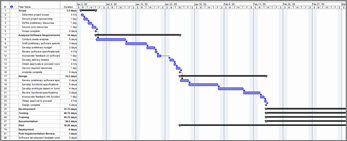

# They say they want a resolution

This article is part of our "From the Trenches" collection. It describes some common challenges you may face when scheduling projects. It describes coming up with the best approach when you try to determine how long tasks should be and how many tasks there should be to optimize a project schedule. It discusses how different industries typically require different types of schedules (for example, software development, EPM (engineering, procurement, and construction), and plant shutdown). It also discusses several factors in choosing project resolution (for example, length of project, resources involved, management or division of resources, speed and effort required in collecting data, and data update schedule). 
  
To download the Word version of this article, see [They say they want a resolution: white paper (Project Server 2010)](https://go.microsoft.com/fwlink/?LinkId=236030).
  
To see more articles, see ["From the Trenches" white papers](https://support.office.com/article/faec6b1a-c217-4c79-b8c4-0514f402106b).
  
## They say they want a resolution

With apologies to the Beatles for the title, today's topic is the resolution of your project. 
  
There are lots of materials available on how to make a schedule, but one of the most critical lessons is awfully hard to come by—how many tasks you should have in your project schedule and how long each task should be?
  
On a regular basis I'm confronted with project schedules that seem impossibly complex or with project managers who seem helpless to pinpoint trouble in their schedule because the schedule is at such a summary level. I've seen a project that was over a hundred years long (yes, really) that was perfectly appropriate in length and in which there were some tasks that were decades long. I've also seen project schedules that lasted only an hour or less that were perfectly appropriate and in which some tasks lasted only a single minute. I've seen projects with only a handful of tasks and others with over 100,000 tasks. 
  
The software we use today can handle thousands of tasks and a wide range of durations. 
  
So, what's the right approach? 
  
 How long should tasks be, and how many should we have to optimize our project schedule? I will call this the resolution of the project. 
  
### Different strokes for different folks

Because the requirement might be different for different industries, different kinds of projects, and different situations, let's look at how to decide how many tasks to put in your schedule and how long tasks should be.
  
 Different kinds of projects naturally call for different kinds of schedules. Let's think about three different examples: 
  
1. **Software development**. Many software projects have common characteristics. While every software project is unique, there is typically a design phase, a programming phase, a quality assurance phase, a document phase, and a deployment phase. Software projects are typically measured in weeks or months, and that lends itself to tasks that are a day to a couple of weeks long. Resource allocation here is often assigned to the individual level.
    
    Those who have embraced the Agile process for developing software look to short "sprints" of one or two weeks and within that sprint put tasks that are of brief duration, but the overall project duration is still measured in weeks. We'll talk more about Agile development a bit later.
    
    
  
2. **EPC - Engineering, Procurement, and Construction**. EPC projects are where the Critical Path Scheduling methodology got its start. In this kind of project, something very big is being developed. It could be a large defense project like the Polaris Missile project that gave PERT diagrams their start, or it could be an offshore oil rig, a new ship, or a power plant. In these kinds of projects there is an engineering phase where the finished project is conceived. The Engineering phase typically has some aspect that has never been designed before. The Procurement phase looks at locating, contracting for and managing the delivery of supplies or sub-contracts for elements of the project. In the Construction phase, the final product is constructed and then commissioned for use. We typically think of EPC project schedules in many months or several years with activity durations lasting anywhere from a couple of weeks to a couple of months. It's not at all unusual to have 5,000 to 20,000 tasks on such a project. Resource scheduling here is almost always assigned to the skill level rather than the individual, and (just to add to the fun) there may be many sub-projects made into a program or master project for ease of management.
    
    
  
3. **Plant shutdown**. When you do a project schedule for a plant shutdown and turnaround for maintenance you are working in one of the most challenging scheduling environments possible. A plant shutdown to do maintenance comes in two flavors: planned and emergency. Let's leave the emergency type aside for a moment; it's a world unto itself. The duration of a planned plant shutdown is heavily dependent on the type of plant. A nuclear power plant unit, for example, might do a "fast" plant shutdown and turnaround in 12 months. An oil refinery might last 4-6 weeks. But the type of plant project schedule that I find most interesting is a manufacturing mill like a steel mill, a paper mill, or something similar. There are thousands or tens of thousands of such plants around the world, and they must undergo regular maintenance every year or so. 
    
    The cost of the shutdown for these situations is usually measured in opportunity cost; the cost of the product that will not be produced while the plant is idle and undergoing maintenance. This cost is measured in hours, and the cost can be upwards of $150,000 to $250,000 per hour! So the pressure is on minute-by-minute to get the job done. In this kind of situation, the shutdown typically lasts 5-8 days and the delay of a single day is calculated in the millions. If you are only used to longer, more traditional schedules, you might think that in a few short days, "how many tasks could there typically be?" but it's not at all unusual for such a shutdown to have 2,000 to 4,000 tasks, each lasting from 15 minutes to a couple of hours. Resource assignments here are done by skill but resource leveling is rarely done on personnel. With the cost per hour being so intense, it does not matter if you put more people on the project, just get it done in a hurry. Resource leveling in this situation is often done for highly constrained bottlenecks. For example, "we can only fit two people in the electrical room, so that's got to be managed discretely". 
    
    
  
Ok, we now have three kinds of examples, and there are many more, but these three will serve the purposes of the discussion just fine. In type one (Software development), we get tasks that are typically a day or two days to two weeks long. In type two (EPC), we get tasks that are weeks or months long. In type three (Plant shutdown), we get tasks that are measured in units of 6 minutes (1/10th of an hour), 10 minutes, 15 minutes (1/4 of an hour), up to a couple of hours long. It's obvious that in some cases, short tasks make sense and in others long tasks are more appropriate. Following the same logic, sometimes it makes sense to have a huge number of tasks and sometimes it just doesn't. 
  
### Factors in choosing your project resolution

With these three distinctions, it's easy to see that the two-month EPC project task would look ridiculous in a six-day shutdown schedule and that a 15-minute task would be out of place in the EPC or Software project. But aside from referring back to this article and saying, "Vandersluis says it's a software project so tasks can only be 1-10 days long," (and please, don't do that) what characteristics of the project tell us what level of resolution to choose? Let's take a look at a few obvious ones: 
  
#### How long is the project?

Let's start with the most obvious. If your project is expected to be a few days long, such as in our Shutdown example, then having tasks that are several days long makes no sense at all. Starting with a top-down approach is often productive when we think about sub-dividing the scope. Use work-breakdown structure thinking. Start with the major components. Think about having no less than 4 and no more than 20 items. 
  
Is it a rule? No, of course not. 
  
It's common sense. Less than 4 makes you wonder why you divided the work up at all and more than 20 is too hard to hold in one's mind at one time. Personally I go with no more than 8 items per WBS element and that's because of some article I read years ago that suggested that an octagon was the most complex simple shape the mind could immediately recognize. 
  
Think about that for a moment. You can identify a circle, a triangle, a square, a pentagon, a hexagon which has 6 sides, a heptagon which has 7 sides (ok, that one is hard to visualize) and an octagon. 
  
Can you identify a 9-sided shape without counting? I can't. It's called a "nonagon" for you trivia buffs. 
  
So, personally, I strive for the 8-item limit but my rule of thumb is 4-20. 
  
 For each element that you looked at, think about how you should divide up the work. Again, think of the 4-20 rule. But knowing when to stop is the secret. Newer project managers will sub-divide and sub-divide and sub-divide until every step down the corridor is a managed task. Some good watershed questions you can ask yourself about the length of a task could be: 
  
- **What action would I take if this task was late?** If the answer is 'nothing' then it's a good indication that the task you're thinking of is too small to be worth managing. If that's the case you are looking in too much detail. Back up a level, take a step back, and see if you are done. 
    
- **Will collecting the data on the update of this task take longer than the task itself?** We do not always think of what kind of effort it will take to manage a scheduled task, but it's worthwhile to think about even if for a moment. If it's going to take more effort to manage the task than it will take to complete, then that is a good indication that the task is being defined at too fine a level of detail. 
    
- **How long is this task?** When we are sub-dividing work, sometimes we lose sight of how minuscule a task becomes. The big phases at the top level were perhaps weeks long, but as we get down a couple of levels of granularity, we can easily fall into the trap of defining a task to be managed that is only a few minutes long. When we get to tiny tasks, we have to ask what the benefit would be of managing them. 
    
Let's apply a reality check to what I've just talked about. In a two-year EPC project, if a one-week task is a day late, it's almost certainly not worth taking action over. In a six-month Software project, a one-week task that is a day late is probably not worth taking action over. In a six-day Shutdown project, a one-week task that is a day late is a massive emergency. In other words, a one-week task in the EPC project may be too fine a level of detail; in the software project, it's probably just about right; and in the Shutdown project, it almost certainly needs to be broken down into more detail. 
  
#### How many resources are involved?

I know we are just working on the scope, but when we look at what kind of resolution we require, it's worthwhile to think about how many people will be working on a task. In a large EPC project, for example, we may have dozens of workers from one skill involved in a phase of work. But when we end up with many different skills in the same task, managing that task becomes very challenging, if not impossible. So, in that situation, tasks that require many different skills probably have to be divided up. 
  
 In a software project, we tend to think of almost every individual as a highly technical resource with unique capabilities. Plus, in software projects it is common to have many tasks that are re-assignable within a department but only one task assigned to one person. So when we have tasks that are allocated to a one-person level of a particular resource group or department (for example interface programming) we are close enough to say that we do not need more detail. 
  
#### How are resources managed or sub-divided?

How resources are managed is a big determinant in how to sub-divide your tasks. In large EPC projects, for example, projects are often cut up into sub-projects that are parceled out to huge sub-contractors. In this situation we need to do a couple of things: 
  
- Define the work in a way that lets a project manager oversee the sub-contractor with confidence that progress being made is a big factor. 
    
- Define the tasks in a way that the sub-contractor's project management and engineering staff will understand what they mean with no ambiguity.
    
- Ensure that the level of resolution that you have adopted as your standard is understood and agreed to by the sub-contractor.
    
When we look at white-collar projects such as software, biological research, or engineering, we are most likely to encounter a Matrix Management structure where project managers own none of the resources and we must work across department managers who allocate those resources across many different projects. In this case, the key questions would be:
  
- How many projects is a resource likely to work on across a single day?
    
- How long does it take an employee to switch from one project to another?
    
- Is the work defined such that both the employees and the resource department managers understand how to allocate the right skill to it?
    
When we look at a Shutdown or Construction project, we tend to work across crews that are purpose-built. In these situations, a Resource Team Leader might be managing the Electrical Team (even if that team includes carpenters and pipe-fitters), a Plumbing Team, or a Boiler Unit Refurbishing Team. The work has to be organized in such a way that the crew can be kept busy throughout the shift and that they won't arrive on top of another crew already working in something in that area. Given the intense pressure of getting a Shutdown project complete, the work is often organized by work first, scheduled, and then regrouped and sub-divided by a Resource Team Leader so each team leader can walk around with only their tasks in one document and with the entire project in context in another. So tasks have to be defined in a way that is understandable by the employee and by the Resource Team Leader. Tasks here are probably defined down to the hour or with even more granularity to the tenth or quarter of an hour. 
  
#### How quickly can you gather data and how much effort does that take?

It sounds like a silly question when you're used to seeing your project data all nicely lined up at the end of the week to be reviewed, but when you are trying to determine the level of resolution of your project, this can be a key question. For example, when you are working through numerous sub-contractors, it is likely that you will get some kind of weekly or monthly update. In fact, building the project management update clause into your contract is essential. In this situation you have to integrate the data from these different companies into your own, validate that the progress data makes sense, and then do your own analysis and reporting. In an EPC mode, this is probably a monthly occurrence.
  
In a shutdown project, you will need to be updating your project every shift, update it quickly, and get the updates to the Resource Team Leaders in the middle of the next shift. In this situation, project personnel swarm all over the plant all during the shift, gathering data in as close to real time as they can and having Resource Team Leaders and Foremen use 'take-down' sheets to 'take-down' the progress of their assignments. In a software or research project, you are probably working on a weekly schedule or something like it with individuals reporting their own progress and going through approvals over a day or two.
  
This is an important point to consider when you are looking at how many tasks to have in your project, because there is a cost to gathering the data.
  
So thinking about how quickly you can collect, approve, integrate, analyze, and report the data on a regular cyclical basis is key, as is the consideration of the cost of collecting the data and the return on investment of that data being collected.
  
#### How often will we update?

Here are two keys to determine how much data you can collect and include:
  
- Think about how you will collect your data.
    
- Think about how often you can reasonably update your project and provide management with the decision-making tools required to guide the project and the resources in the right direction.
    
I've seen some project managers insist that they want to move to 'real-time' project management and project collection and while this may be possible in theory, it is terribly difficult to realize in practice. 
  
When we look at project management data we make some assumptions. We assume that:
  
- **The data is all there**. We do not expect to be looking at some tasks that are updated and other that are not.
    
- **The data was all updated at a similar time**. We do not expect that half the tasks were updated a few minutes ago but the other half have not been updated for two weeks.
    
- **The data has all had some level of approval**. We expect the project manager to stand behind the data being presented and that he or she is able to say "This is a fair and accurate representation of the project."
    
- **The data belongs together**. We do not expect risk to be blurred with costs and with resources unless we have specifically designed our reports and analysis that way.
    
I often ask executives who are excited about the concept of real-time project management what they will do if we could overcome the points I just raised above. "Are you prepared to take management decisions all throughout the week?" I'll ask. The response should depend on the level of resolution. In a shutdown project the answer had better be 'Yes'. In a software project, the answer is probably 'No, we'll do that weekly'. And in an EPC project the answer would be, 'Monthly'. 
  
At some point the law of diminishing returns kick in to say, "Delivering project reports any quicker will not give us any increase in efficiency." 
  
### Reviewing your work

You have now had some food for thought, you have used the Work Breakdown Method to sub-divide your data, and you have watched for some of the warning signs that the data is too finely defined. Now it is time to lean the schedule up against the wall, step back, and look at the project with some perspective. Amazingly, many project managers never do this. They get so caught up in getting the last details defined and are so busy sub-dividing tasks again and again that they push themselves right up to the go-live deadline and never look up to see whether what they have made will be a nightmare to manage. 
  
In some cases, executives are sure from all that MBA training that "more detail is better" and they are pushing for those 5-minute or 15-minute tasks on six-month-long projects. 
  
Changing the project before it starts is always easier than at any time later, so build time into your schedule-building activity to rework the schedule if required. 
  
#### Is it too much?

Sometimes project managers look at the scope of what they have created and realize that they are at too fine a level of detail. If that is the case, the fix is obvious. It may be a lot of work, but you will thank yourself later to make the schedule simpler by moving up a level. 
  
Sometimes the picture is not so easy. In some cases, it is only once the entire schedule is assembled that the project manager can see how complex it is. Complex projects are, by their very nature, riskier, and risk in today's economy is a key selection factor for projects. Some questions that are worth considering before such a complex project gets underway might be:
  
- **Can we do it in pieces?** Some risky projects can be broken up into smaller bite-sized portions and as smaller projects, their risk goes down. However, if you are using this strategy, each discrete project should have its own value when it is complete. 
    
- **Should we rethink the scope?** Sometimes the simplest actions are to go back to the designers of the work in the first place, explain the complexity that seems apparent in the schedule, and see whether the work can be restated. This often leads to innovative thinking that would have never had a chance to occur. 
    
#### Should we do it at all?

Some projects were never meant to be, and the cheapest time to cancel them is the day before they start. If the risk of the project is only now apparent, better to realize it now than later. When you weave the findings of doing your schedule back into the Project Portfolio Management (PPM) process, you might find that the risk of the more complex project has the work score much worse in a return-on-investment scale. 
  
#### A nimble… no, an Agile project

I promised to say a few things about Agile project management and if you are an Agile fan and you have read this far, I appreciate your patience. Managing software projects through the Agile method is something of a philosophy, but it is a more and more popular philosophy with those who have been burned on massive software development projects that failed.
  
In an Agile software development world, we try to break our project into bite-sized, one-to-three week "sprints" and the goal for each mini-project is to end up with useable code. In this case we are working within some fairly well-known constraints so that our level of resolution is pretty much picked for us. 
  
We have a one- to three-week window, the resources are available to us, and we are going to assign work to each resource. The number of possible tasks that we can define in that structure is finite and this lends itself to keeping an appropriate level of resolution. Yes, you can get into trouble in Agile by defining tasks that are much too short. "Define Field1: 10 minutes, Define Field2: 10 minutes, Define Field3: 10 minutes" etc. but it's much less common. 
  
Agile was designed for a corporate development environment where we are creating software for in-house use, and its use is often extended to commercial software development. (We use the method here at HMS for our own development of TimeControl.) The Agile method results in a more maneuverable and nimble development department but it is not going to be applicable to every industry or even every software company. If you are doing project management in a software environment then my recommendation is to read up on Agile, learn from it, and then adopt those elements (all, some, or none) that will make you most effective.
  
### Wrapping up

As with most aspects of project management, there's no set answer to questions that at first seem to be so obvious. How many tasks you have in your project and how long each of those tasks should be is something that you need to look for yourself to decide … but decide you must. 
  
 Choosing your project level of resolution is a project management responsibility that can be a key success factor in the management of the project schedule. 
  
## About the Author

Chris Vandersluis is the president and founder of Montreal, Canada-based HMS Software, a Microsoft Certified Partner. He has an economics degree from McGill University and over 30 years experience in the automation of project control systems. He is a long-standing member of the Project Management Institute (PMI) and helped found the Montreal, Toronto, and Quebec chapters of the Microsoft Project Users Group (MPUG). Publications for which Chris has written include Fortune, Heavy Construction News, Computing Canada magazine, and PMI's PMNetwork, and he is a regular columnist for Project Times. He teaches Advanced Project Management at McGill University and often speaks at project management association functions across North America and around the world. HMS Software is the publisher of the TimeControl project-oriented timekeeping system and has been a Microsoft Project Solution Partner since 1995. 
  
Chris Vandersluis can be contacted by e-mail at: chris.vandersluis@hms.ca
  
If you would like to read more EPM-related articles by Chris Vandersluis, see HMS's EPM Guidance site (https://www.epmguidance.com/?page_id=39).
  

