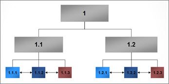
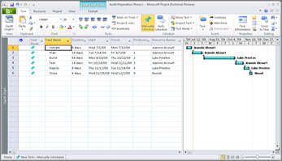
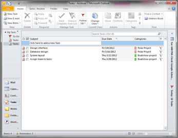
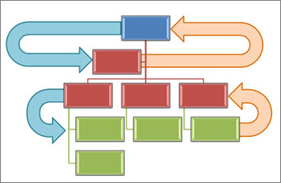

# Top-down or bottom-up: white paper

This white paper is part of our "From the trenches" collection. It discusses project management, portfolio management, and task management, and it compares the top-down and bottom-up management practices related to them.
  
To download the Word version of this white paper, see [Top-down or bottom-up: white paper (Project Server 2010) ](https://go.microsoft.com/fwlink/?LinkId=246608).
  
To see more white papers, see ["From the Trenches" white papers](https://support.office.com/article/faec6b1a-c217-4c79-b8c4-0514f402106b).
  
## Top-down or bottom-up?

"We need project management… Ummm, I meant portfolio management… Ummm, I really mean task management… Oh heck, we need all of them," is a battle cry I hear often. It's not a lack of definitions of these three concepts that causes confusion, it's their similarity.
  
Those of us who have worked in IT for many years tend to see things from a technical perspective and sometimes it doesn't serve us well. If we look at data from Portfolio Management, Project Management, and Task Management, it might look very similar. I've got an ID field, a description field, and a start and end date in all three. Linking all three of these should be natural then. 
  
Perhaps not. 
  
Let's take these three concepts one at a time. It's easy to see their similarities, but there are fundamental differences in the three perspectives.
  
### Portfolio Management — a top-down approach

People can mean a lot of different things by "portfolio management," but the most meaning common is probably project selection and prioritization. The principles ultimately affect everyone in the organization, but the process is of great interest to senior executives. Management starts off with certain constraints, such as a total available budget and a need to answer the question, "What can we and should we accomplish with this amount of money?" If the portfolio management process is sufficiently mature, this analysis might include not just new ideas but also existing projects.
  

  
To create a portfolio selection and prioritization process, management must confront what business criteria drive the company and agree in advance on the metrics that will be considered when looking at new and existing projects. Should return on investment be a key metric? Perhaps we should consider effects on client satisfaction or staff retention or alignment with strategic objectives. Whatever the key metrics are, management has to weigh each project initiative with a view to how that project can advance those objectives and how each project compares with alternate initiatives on which the money could be spent. 
  
This is a highly analytic process even if it's done in one's head. It's certainly highly analytic when you are using project portfolio management software. Even once the analysis from software arrives in a report or a view, there is virtually always some management-level oversight where a final decision on priorities gets made. When that is complete, the final results must be transmitted to those who will do project management of each of the projects. The effects of these decisions will be to fund some projects and not to fund others, to make available resources on a higher priority to some projects and not to others, and to advance the schedule of some projects and to delay others. 
  
#### Project Management — top-down and bottom-up

Once a project is approved, it moves into a different realm altogether. Now the more classic view of project scheduling comes into focus. Now we have to actually build the thing we described in our business justification before it was approved. 
  
A project manager starts thinking in terms of project scope and deliverables. The project manager knows the final product that must be created, whether it is a piece of software or a building ready for occupancy. They may think of the major phases of that project and create a work breakdown structure. 
  

  
A critical path of logical steps required to complete the project gets designed. The project manager also knows that he or she will be held to account for the schedule that is produced, so he or she consults a range of subject matter experts in the project. The project manager creates a bottom-up view of the project by looking task by task and summarizing those tasks up to project phases and eventually to the project itself. At this time the project manager might also start allocating resources by skill, by department, or even by name. These resources might have costs associated with them. The result of calculating the duration of the tasks, the resources required, and their rates gives us a bottom-up estimate of the project.
  
So far, so good.
  

  
But when we look at the top-down approach of the project portfolio selection process, there was a cost, too. In fact, the estimated cost of the project was part of the business justification that management considered when it approved the project. If we're just getting the bottom-up estimate of the project from combined expertise of the subject matter experts now, what did they use in the project selection up in the executive suite?
  
It's a good question. In some organizations, the project will be given a rough estimate from the project department in order to create a business justification for the project. In other organizations, a complete bottom-up estimate is created prior to considering the project in the portfolio process. The problem with both of these approaches is that they take effort. A complete estimate may take a lot of effort and yet the project has yet to receive approval for funding any effort. So, in many organizations, someone in management simply makes a guess as to what the costs of this project will be.
  
So the process looks all integrated but there may be a bit of a catch-22 here. Which comes first, the work spent on doing the estimate or the selection of the project in order to be able to spend time on the project?
  
Moreover, what happens if the bottom-up estimate doesn't match the estimate of the portfolio selection process? If the estimate is less, there's probably no issue, but if the work can't possibly be completed in the time or budget estimated by the portfolio selection people, there is a conflict. 
  
You might think that the natural thing to do would be to reconvene senior management and just discuss the problem, but there are a lot of situations where that isn't as easy as it seems. 
  
First of all, the portfolio selection committee is rarely the project management staff. Senior project management staff members are almost always included in the portfolio selection committee, but the group itself is usually very senior executives who find it challenging to organize time to all be together. Secondly, the selection committee may meet irregularly, so getting them back together to discuss all the ramifications of a mismatched cost for one project versus the estimate might be a big challenge. Finally, there are some corporate cultures where it will not be a career-advancing move to have to deliver the news to the senior executive that their guess is completely wrong on what the appropriate schedule and budget for this project is.
  
#### Task management — a bottom-up approach

When we think of task management, we tend to think very operationally, and that most often brings us to our daily agenda and a product like Outlook.
  

  
Now we're working at an individual or a small team member level. We don't see the tasks in context. We see those things we've committed to or perhaps those things we've asked a team member to commit to. This is not an analytic view at all. There are tasks to do and the individual has promised to do them.
  
At its core, task management is very straightforward. You do the task and when you're done you tell the person who gave you the task to do that it is complete. All the functionality for this is already in Outlook.
  
#### The mischief of similar data

There's a saying, "If it looks like a duck and quacks like a duck, it must be a duck." That's true for ducks, but it isn't always true for task-based data.
  
Let's consider these three levels of project-oriented data:
  
- At the portfolio level, we have a project and perhaps phases below that project. The phase information might have a code number, a description, a duration, a start date, and an end date.
    
- At the project level, we have a project and tasks below the project. The task information might have a code number, a description, a duration, a start date, and an end date.
    
- At that task management level, we have a task and the task information might have a code number, a description, a duration, a start date, and an end date.
    
They sure look the same, but in fact, the perspective of the data makes each of these rather common records serve a very different purpose.
  
I'm often asked, "Can I move data from the portfolio view to the project view to Outlook and back." 
  
The short answer to that question is "Yes."
  
But in our firm we have a mantra we say to ourselves when we're giving technical advice: "Don't tell me how to do it, tell me why you should do it." 
  
1. To make the point, imagine this example. We make an entirely integrated environment. At the top end of the scale we have a list of projects organized by portfolio. Not only do we select these projects, but we integrate even further, following them after they've been activated into live projects from the EPM system. To do this, we use functionality already available to us to move the project and phase definitions from the Portfolio side of our integrated system to the project side of the system. The data looks identical.
    
2. In our enterprise project management system we now make a more detailed definition, using the original phases from the portfolio definition that was pushed from the top down. Doing this allows that summary to be updated in the portfolio system when we update our projects. We make many tasks and assign many resources. We now do a resource-leveling analysis to determine our capacity across many projects.
    
3. We use our resource assignments to push task and assignment data to each user as an Outlook task or calendar event. Users no longer need to go to a "project management system". They are now able to see their data in their daily agenda. The data looks just like it does in the project list and is linked further upstream to the portfolio view.
    
4. Progress from these tasks and availability from Outlook is moved back from the individual to the project management system along with estimates on when this work will be completed. The data looks just like it does in the other two systems, so moving the data is relatively easy.
    
Creating such a system is technically very straightforward using the tools available to us today along with a bit of configuration and development. And it would demonstrate beautifully. 
  
We get asked for exactly this type of structure on a regular basis. But, even though we can do it, should we? 
  
Imagine that at the task level, an individual takes the morning off for an emergency dental visit and updates her Outlook that she will not be available this morning. That's bad news for him but the ripple effects to the project could be massive. Now, the project system calculates that the task that was scheduled to be done this morning won't be completed today; it will be completed only at mid-day tomorrow. It dutifully looks at the critical path and all tasks downstream from this one and pushes them forward by four hours. Perhaps hundreds of tasks were affected. The result might be pushing the end date of the project a half day later. Other projects are also affected as other people working on this project must now have their tasks re-arranged and the portfolio view itself slides forward a few pixels. 
  
If we imagine this in real time, the problem is magnified. Hundreds or thousands of people are making changes all through the day, and the EPM view, the resource leveling view, and the portfolio view animate back and forth with the effects.
  
In reality this doesn't happen. First of all, the hapless dental patient will be back at her post at noon and may just work a few hours later tonight to make sure this critical path is caught up and all will be back on track in the morning. 
  
Plus, even though the data looks the same, it is never integrated this way because of exactly this effect. 
  
#### Data Context — the perspective matters

When we look at data, the context of the data is critical. Data that may look the same from a record-to-record schema is used for very different purposes based on the perspective of the application. 
  
In a top-down portfolio view, we are making strategic decisions of where to put our resources to maximize our return on investment. We might make choices that a project manager wouldn't make. In my own organization, we have sometimes chosen projects that are completely outside our existing skill set, knowing that we would be terribly ineffective at accomplishing them but doing so because we wanted to improve those very skills. The return on investment wasn't an effective installation, it was trained installers. This is an analytic view. 
  
In a tactical project view, we are making operational decisions about where to get the best throughput of our personnel and to get our projects completed as quickly and efficiently as possible. A project manager's eye is always to the future. What happened in the past is only of interest to the project manager insofar as it improves his or her view of the future. This is also a highly analytic view.
  
In a task management view like an agenda, we are not analytic. An agenda is a commitment system. We promise ourselves or others that we will do a particular thing at a particular time. This might fit the analytic view. And it might not. 
  
Mixing these perspectives and contexts without understanding the impact can cause chaos.
  
#### Top-down or bottom-up?

There is, as usual, no right answer. Some aspects of your project management system really need to come from the bottom-up. After all, in the end, it is individuals who will build whatever your project is about. But some decisions are, and should be, made from the very top and are, as a necessity, top-down.
  
When you keep the distinctions of what each level of the project management paradigm is for, it does become clearer to see if some of these systems should really be integrated or not. If the process and thinking of one level doesn't have direct benefit by being fully integrated from another level, then integration is not the best play. It's important to walk through how such integration would work in a real-world context and whether the frequency and detail from one level delivers any value to the other.
  

  
If, for example, a steering committee only meets once a quarter to make big-play decisions about which projects to move forward and which not, then what is the benefit to updating their view every day, every week, or even every month? 
  
Does the enterprise project management resource-leveling algorithm really need to see the dental appointment of an individual or is it enough to know the approximate availability of that individual?
  
And yet, if we could send an assignment to an individual's agenda or timesheet screen directly, would that save them a few minutes each day having to go into a different system and interface to see the same data? 
  
So, top-down is right in some circumstances and bottom-up is right in others. You have to look at your own situation to see where integrating these tools and concepts can pay back the right dividends before tying them together. 
  
## About the Author

Chris Vandersluis is the president and founder of Montreal, Canada-based HMS Software, a Microsoft Certified Partner. He has an economics degree from McGill University and over 30 years experience in the automation of project control systems. He is a long-standing member of the Project Management Institute (PMI) and helped found the Montreal, Toronto, and Quebec chapters of the Microsoft Project Users Group (MPUG). Publications for which Chris has written include Fortune, Heavy Construction News, Computing Canada magazine, and PMI's PMNetwork, and he is a regular columnist for Project Times. He teaches Advanced Project Management at McGill University and often speaks at project management association functions across North America and around the world. HMS Software is the publisher of the TimeControl project-oriented timekeeping system and has been a Microsoft Project Solution Partner since 1995. 
  
Chris Vandersluis can be contacted by e-mail at: chris.vandersluis@hms.ca
  
If you would like to read more EPM-related articles by Chris Vandersluis, see HMS's EPM Guidance site (http://www.epmguidance.com/?page_id=39).
  

