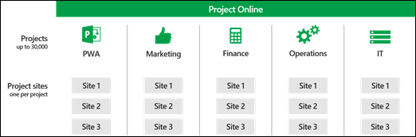
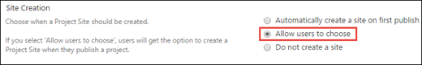
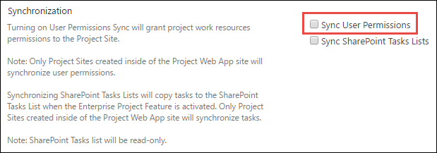
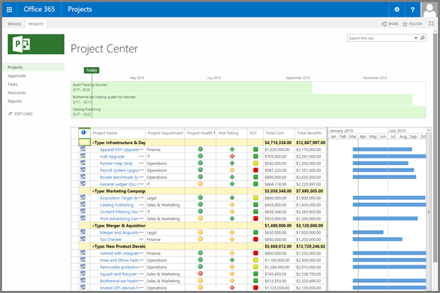
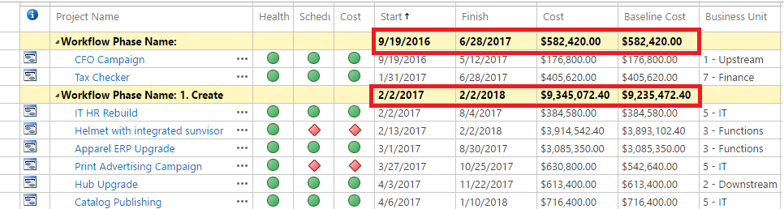
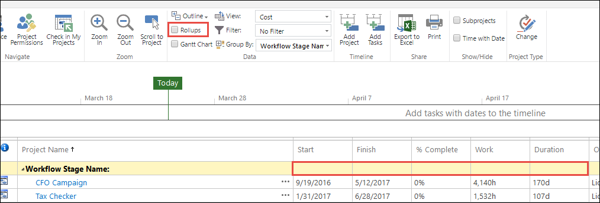
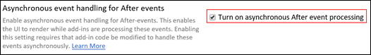

# Tune Project Online performance

  
With the launch of Project Online a few years ago, organizations of all sizes have been able to use Microsoft's rich set of Project Portfolio Management (PPM) capabilities within the convenience of our Office 365 cloud infrastructure.
  
Although one of the obvious benefits of using a cloud-based service is avoiding having to deal with deployment, setup, and hardware and software tuning, there are still some steps you can take to ensure your organization gets the best performance out of Project Online.
  
Project Online offers many configuration and customization settings, but customizations can have a performance impact. This article highlights the performance impact and tradeoffs of some of the most common Project Online settings, so you can make informed decisions when it comes to customizing and configuring Project Online.
  
||
|:-----|
||
|This article is part of the [Network planning and performance tuning for Office 365](https://aka.ms/tune) project. ||
   
## Office 365 and SharePoint Online best practices

There is a wealth of information around network planning and performance tuning for [SharePoint Online](https://go.microsoft.com/fwlink/p/?LinkId=544778) and [Office 365](https://go.microsoft.com/fwlink/p/?LinkId=544780). All this information is relevant to Project Online customers and should be consulted in addition to the following best practices specific to Project Online.
  
## Project Online configuration and customization

Many elements of a Project Web App site can be configured and customized, from administrative settings to permissions, and from collaboration settings to look-and-feel. Let's look at the settings that can potentially have an impact on the overall performance of your Project Web App site.
  
We will cover:
  
- Security permissions modes
    
- Enterprise Project Types
    
  - Project site configuration
    
  - Synchronization mechanisms between Project Online and SharePoint Online
    
- Active Directory Resource Pool sync
    
- UI customization and look-and-feel
    
- Project Detail Pages (PDP) and workflows

- Event Handling
    
- OData and reporting
    
- Project Online quota
    
(Some of this information applies to Project Server 2013 and Project Server 2016 as well.)
  
## Permission modes: SharePoint or Project

With Project Online and Project Server 2013, we introduced a new and simplified permission model called SharePoint permission mode, as opposed to the legacy Project permission mode. The comparison between both modes can be found on [Technet](https://go.microsoft.com/fwlink/p/?LinkId=544784).
  
New Project Online instances are provisioned in SharePoint permission mode by default, and we are confident this mode will address the needs of the vast majority of customers. By using this mode, you can manage user authorization via regular SharePoint groups and permissions.
  
Project permission mode offers a high degree of customizability, but it can come at a price in terms of performance. If you create hundreds of categories and rely heavily on dynamic permissions via your Resource Breakdown Structure (RBS), it might slow down the end-user experience for users who have access to a lot of content, such as admins and portfolio managers.
  
> [!NOTE]
> Switching between SharePoint permission mode and Project Server permission mode deletes all security-related settings. If you switch from SharePoint permission mode to classic Project Server permission mode, you have to manually configure your security permissions structure in Project Server 2013 and Project Server 2016. Switching from Project Server permission mode back to SharePoint permission mode deletes your security permissions information from Project Server 2013 and Project Server 2016. 
  
 **Recommendation:**
  
When possible, keep the default SharePoint permission mode for better overall performance. If you need to [use Project permission mode](change-permission-management-in-project-online.md), limit your customizations as much as possible.
  
## Enterprise Project Types

An [Enterprise Project Types](https://support.office.com/article/c576de02-a25c-4ea1-9de6-02be44dbb0a6) (EPT) represents a wrapper that encapsulates phases, stages, a single workflow, and Project Detail Pages (PDPs). 
  
EPTs also allow you to define:
  
- Project site configuration
    
- Synchronization mechanisms between Project Online and SharePoint Online
    
### Project site configuration

Project sites are built on core SharePoint functionality. Creating project sites is not a lightweight process, and deciding if and when your organization might need project sites can go a long way in improving the overall end-user experience.
  
A lot of organizations use Project Online to collect and rate project proposals before deciding which projects to fund. If project sites are set to be automatically created the first time a project is published, then all project proposals, even the ones that don't make the cut, get a project site. These unnecessary sites would have to be manually cleaned up afterwards.
  
A better approach, if you decide to use project sites, is either letting the user choose when to create their collaboration site, or, even better, having it created by a workflow as soon as the project proposal reaches a certain stage gate.
  
SharePoint Online currently [SharePoint Online limits](https://support.office.com/article/8f34ff47-b749-408b-abc0-b605e1f6d498) the number of subsites that can be created for each site collection. An EPT allows you to define which site collection to create new project sites in. This will allow you to create a project site for each project as you can span them across multiple site collections. 
  

  
For example, if you have a site collection dedicated to your IT department, you can configure your  *IT Projects*  EPT to create Project sites off of  *https://contoso.sharepoint.com/sites/IT*  . 
  

  
 **Recommendation:**
  
If your organization uses project sites, select the option to create them on demand rather than automatically. This speeds up the first publishing experience and avoids creating unnecessary sites and content.
  
For each EPT, you can configure this option by:
  
1. In Project Web App Settings, click **Enterprise Project Types**.
    
2. Select the EPT to which you need to change the setting.
    
3. In the EPT settings page, in the **Project Site** section, select **Allow users to choose**.
    

  
Create project sites in their own site collection by the EPT. Keep the number of project sites in a site collection below the SharePoint Online [SharePoint Online limits](https://support.office.com/article/8f34ff47-b749-408b-abc0-b605e1f6d498).
  
### What do you sync?

Project Online runs on top of SharePoint Online the same way Project Server runs on top of SharePoint Server. As a result, we have to keep in sync a certain number of components between to two systems. These synchronizations can be time consuming and, depending on your business needs, can sometimes be unnecessary. This article explores all these various synchronization systems to help you decide which ones you need and which ones you can safely turn off. Some of these settings are already off by default.
  
In the following sections, we discuss:
  
- Sync user permissions for your project site
    
- Sync SharePoint Tasks Lists for Enterprise projects
    
### Sync User Permissions

Project Sites are workspaces where project teams can collaborate, upload documents, and raise issues. When sync user permissions is turned on, whenever a person is granted permission to a project, the corresponding Project site permissions are updated.
  
This synchronization happens every time the project is published. The tradeoff for the sync convenience is performance, e.g. the more users and sites that need to be synced, the slower the operation, especially if you're bulk publishing, importing or creating multiple projects (with Projects sites), or updating group memberships that will require a resync of project site permissions.
  
For each EPT, you can define if sync user permissions is turned on.
  
> [!NOTE]
> If project sites are created in a different site collection than where the Project Web App site is located (for example, https://contoso.sharepoint.com/sites/pwa is where Project Web App is located and the EPT is creating project sites in https://contoso.sharepoint.com/sites/IT), syncing user permissions is not supported. 
  
 **Recommendation:**
  
We strongly recommend that you disable the Project site permission sync option if the following is true of your deployment:
  
- You have a large number of resources (\>1000)
    
- You have a large number of projects which require a Project site (\>1000)
    
- You have a large number of resources that need to be granted access to the majority of Project sites
    
- Project sites are created outside of the default site collection (sync is disabled)
    
Here are some options to consider for managing your Project site permissions:
  
- If your project teams have low turnover, consider turning off Project site permission sync to improve Project Publish and Project Detail Pages performance. You would then have to manually grant or remove permission to your Project sites whenever someone joins or leaves a project team.
    
- If access needs to be granted for all users in PWA and it maps to your existing group permissions, consider configuring your Project sites to [inherit](https://support.office.com/article/06bb1ed1-d150-42f4-9600-fb261d4b590c#__toc340139789) from the parent PWA site. 
    
- If site access aligns with specific roles, create one or more groups that map to those roles (possibly if you have Group sync enabled, you can use the same groups) and grant those groups access to the Project site.
    
For each EPT, you can turn on Sync User Permisssions by:
  
1. In Project Web App Settings, click **Enterprise Project Types**.
    
2. Select the EPT to which you need to change the setting.
    
3. In the EPT settings page, in the **Synchronize** section, select **User Permission Sync**.
    

  
### Sync SharePoint Tasks Lists for Enterprise projects

 **Sync SharePoint Tasks Lists** is turned off by default to improve the speed of project publishing. This also helps speed the transition between Project Detail Pages. If your users rely on the task list and its timeline visualization in the Project site, you can turn this feature on and check if its impact on the performance of project publishing is reasonable. 
  
> [!NOTE]
> If project sites are created in a different site collection than where the Project Web App site is located (for example, https://contoso.sharepoint.com/sites/pwa is where Project Web App is located and the EPT is creating project sites in https://contoso.sharepoint.com/sites/IT), syncing SharePoint Tasks Lists is not supported. 
  
 **Recommendation**
  
The Sync SharePoint Task Lists option was intended for use with small project plans. If the project has a large number of tasks, syncing them on publish will take some time as each task needs to be updated one at a time. For example, it takes several minutes to sync a 500 task project plan to the SharePoint task list. Even though the queue job is on a separate correlation and does not block saving and editing of the project plan, we recommend not enabling the Sync SharePoint Task Lists option. We recommend only syncing projects with less than 250 tasks.
  
This option is turned off by default. Only turn SharePoint Tasks Lists sync on if your users need the feature for each EPT. To configure this option:
  
1. In Project Web App Settings, click **Enterprise Project Types**.
    
2. Select the EPT to which you need to change the setting.
    
3. In the EPT settings page, in the **Synchronize** section, select **Sync SharePoint Tasks Lists**.
    

  
## Active Directory Resource Pool sync

Active Directory Resource Pool sync by itself does not have particular performance issues and can import thousands of resources into your Project Web App instance in minutes. However, its downstream effect on other parts of the system can impact performance. The primary process to keep an eye on is the resource permission sync previously mentioned. If there is large turnover in your Active Directory groups membership, and that requires you to sync your Resource Pool often, monitor any potential downstream effects on related permission sync jobs.
  
 **Recommendation:**
  
Limit Active Directory sync to groups of resources that actually need to use the system, and monitor any potential permission issues after the synchronization of large groups. (To configure Active Directory Enterprise Resource Pool Synchronization, in Project Web App Settings, click **Active Directory Resource Pool Synchronization**.
  
## PWA pages and views customizations

### Page customizations

The SharePoint platform offers great customization capabilities with its modular webpart infrastructure and support for custom pages. When you add logos, custom webparts, and new themes, it might not have a significant impact on performance on an on-premises infrastructure due to the benefits of server proximity, low latency, and high bandwidth networks. However, on an online service, the story is different.
  
When you upload a logo or graphic with a large file size, it might slow down pages a bit on an on-premises deployment, but online, the performance hit on page loads is substantial.
  
The same principle applies when you add multiple webparts to a page. It might be tempting to have a custom page with multiple webparts, but unless users actually need to see the data side by side, it is better to have separate specialized pages than having it all in one place. If users only need the content of one webpart on the page, they still have to wait longer for the page to load and display the data for all the other webparts.
  
 **Recommendation:**
  
When you customize pages, treat your Project Online site as any regular Internet website, and create lightweight pages as much as possible.
  
### Views customizations

Here again, simplicity goes a long way to improving page load performance. Organizations can create custom views by using multiple Project Web App pages, including Project Center, Resource Center, Tasks, and Timesheets.
  
The more content is displayed, the slower page rendering will be. You can reduce each page load time by a few seconds if you provide users with a greater number of simple and targeted views rather than a few "all-in-one" views.
  
In the examples below, the second view takes an average of 2 to 3 seconds less to load than the first one.
  

  

  
 **Recommendation:**
  
When you configure views, offer users simple specialized views for faster navigation rather than a complex all-in-one view that would load unnecessary data most of the time.
  
### User View Settings

#### Project Center: Group by with Rollups

Users can configure different ways to have the view rendered to them including having data grouped by different fields. When using **group by**, data can be rolled up for supported aggregation fields (for example, summing costs or a custom field). Computing these aggregate values requests the service to load up all the values in order to display the total.
  

  
 **Recommendation:**
  
Unless the user needs to see the rolled up values, disable the **Rollup** option in the ribbon. 
  

  
#### Project Center: Gantt Chart

The chart portion of the Gantt Chart view displays each project as a summary Gantt bar.
  
 **Recommendation:**
  
Unless the user needs to see the Gantt, disable the **Gantt Chart** option in the ribbon. 
  

  
## Custom Project Detail Pages and Workflows

In addition to the recommendation provided above for page design, Project Detail Pages (PDPs) are particular in that they can trigger a recalculation of the entire project and kick off workflow actions, both of which can be expensive operations in terms of performance, depending on your customizations.
  
Project Online and Project Server have two main update processes for project information:
  
- Updates requiring a scheduling recalculation (see list below)
    
- Nonschedule-related fields, such as project name, description, and owner.
    
We recommend that you avoid updating both types of data on the same PDP to avoid triggering both update processes at the same time.
  
Here is a list of the most common actions that require a schedule recalculation.
  
- Project calendar changes
    
- Changes to the following date fields:
    
  - Start date
    
  - Finish date
    
  - Status date
    
  - Current date
    
- Changes in project custom fields
    
- If the project has any dependencies on deliverables
    
A second way to improve PDP performance is to reduce the number of webparts and custom fields displayed on each PDP. If your business processes require frequent updates to the same set of fields, create a dedicated PDP with only these fields to improve load and save time. Displaying all custom fields at all times results in a lot of unnecessary overhead.
  
 **Recommendation:**
  
Create lightweight specialized PDPs, and avoid mixing schedule-related and nonschedule-related updates.
  
### Bulk custom fields updates in workflows with new REST API

Updating project custom fields values in a workflow one at a time requires a separate server request using the Set Project Field action. This results in reduced performance when updating a lot of custom fields at the same time on a high-latency, low-bandwidth network.
  
To solve this issue, there is a [CSOM method to update custom fields in bulk](https://go.microsoft.com/fwlink/p/?LinkId=544812). This method requires you to pass in a dictionary containing the name and values of all the custom fields you want to update.
  
### API for provisioning project sites on-demand

Each project can have its own dedicated SharePoint site where team members can collaborate, share documents, and raise issues. These sites can be automatically created on first publish or manually created by the project manager via Project Pro or the administrator via Project Web App settings, or they can simply be disabled.
  
You can use the [CreateProjectSite('') method](https://go.microsoft.com/fwlink/p/?LinkId=544812) to decide when to create their project sites. This is particularly useful for organizations who want to create their sites only after a project proposal reaches a specific stage in a predefined workflow, rather than on first publish. This significantly improves the performance of project creation by postponing the creation of Project sites. 
  
## Event Handling

Add-ins can respond to events being raised in Project Online. For example, an add-in can perform some additional activity after a project has been created. Users may have to wait for these add-ins to complete handling the events before they can continue working with Project Online. 

 **Recommendation:**
  
Project Online should be configured to handle certain events asynchronously to minimize the amount of time users will need to wait. To do this, ask the developer of any add-ins you use to make sure their code is able to handle After events asynchronously. They can go to [this article](https://docs.microsoft.com/previous-versions/office/developer/sharepoint-2010/gg749858(v=office.14)) to learn more about practices they can follow for handling these events.  

If the developer confirms the add-in is ready for the change, you then need to enable the **Turn on asynchronous After event processing** setting on your **PWA Settings** page.

1. On your **PWA Settings** page, in the **Operational Policies** section, select **Additional Server Settings**.

2. In the **Asynchronous event handling for After events** section, make sure that **Turn on asynchronous After event processing** is selected.<br/>


3. Select **Save**.

You'll then need to test your instances to verify that everything works correctly.


> [!NOTE]
> This feature is being introduced gradually to Office 365.  This means that you may not currently have this setting available.


## OData and Reporting

### Reporting

In Project Online you can choose the granularity of time phased reporting data - or you can choose  *Never*  if you do not need time phased reporting data. This feature is fully documented in [Configure rollup of timephased reporting data in Project Online](configure-rollup-of-timephased-reporting-data-in-project-online.md). Choosing an option that uses the least amount of data that satisfies your reporting needs means that reports will generate quicker, you may be able to use different reporting options as you will have a smaller dataset and you will also benefit from faster publishing of projects. The list of options in order of most benefit to performance are:
  
- Never
    
- Fiscal Periods
    
- Monthly
    
- Weekly
    
- Daily
    
 *Fiscal Periods*  has the big advantage over  *Monthly*  in that reporting data is only held for defined Fiscal Periods, whereas Monthly will hold data for the full duration across all of your projects. 
  
By using the Project OData service, you can extract information from your Project Online instance for reporting.
  
 **Recommendation:**
  
Store the least amount of timephased data that is consistent with your business needs. Do not use  *Daily*  if you have workflows that wait on publish to complete. 
  
#### PowerBI

If the amount of data is small, then Power BI can regularly read data from the Project OData service and help provide a variety of dynamics reports. A sample content pack can be found [here](https://github.com/OfficeDev/Project-Power-BI-Content-Packs).
  
If the amount of data in Project Online is large, you can still bring in a subset of the data as long as it meets the PowerBI data size limits outlined [here](https://powerbi.microsoft.com/en-us/documentation/powerbi-admin-manage-your-data-storage-in-power-bi/#dataset-limits). Another option is to create your reports in a moving window, i.e. filtering projects who were active in the last 30 days or viewing resource capacity for the next 6 months.
  
#### SQL Server Integration Services (SSIS)

Using SSIS, data can be extracted from the Project OData service and can download your reporting data into a SQL server database locally or in Microsoft Azure. A sample SSIS package for the Project OData service can be found [here](https://go.microsoft.com/fwlink/p/?linkid=845597).
  
 **Recommendation:**
  
If your reporting needs still require you to extract a large amount of data, consider using the [SQL Server Integration Services (SSIS) package](https://go.microsoft.com/fwlink/p/?LinkId=544822) to copy your reporting data into a SQL server database locally or in Microsoft Azure. 
  
When using SSIS, please consider the following steps:
  
 **Full Sync**
  
Get a current snapshot of the reporting data you are interested in.
  
1. Record current date/time as sync time
    
2. Download data from each endpoint.
    
 **Delta Sync**
  
Check periodically to keep your copy up to date.
  
1. Record current date time.
    
2. Query ProjectId From Projects endpoint.
    
3. Delete local Projects where the ProjectId no longer exists.
    
4. Query each endpoint by Project:
    
1. Query the entity Ids.
    
2. Delete local entities where the Ids no longer exists.
    
3. Query for mod_dates that has changed since you last synced.
    
#### Custom Fields

When retrieving data from the OData endpoint, extra computation is required when using custom fields which are multi-value lookups. The extra computation does not allow the OData endpoint to take advantage of a number of optimizations.
  
 **Recommendation**
  
Do not use multi-value lookup custom fields.
  
### Querying OData

There are [limits](https://go.microsoft.com/fwlink/p/?linkid=845599) to the number of entities that can be returned in one query of the ProjectData service. As a result, querying a large amount of data requires multiple web requests to be sent to the service, adding network overhead and latency for each request. 
  
For a Project Web App instance that contains a large number of entities, such as projects, assignments, or tasks, you should limit the data returned in at least one of the following ways. If you don't limit the data returned, the query can exceed the default limits and affect server performance.
  
- **Use a $filter URL option, or use $select to limit the data.** For example, the following query filters by project start date and returns only four fields, in order of the project name: 
    
  ```
  http://ServerName/ProjectServerName/_api/ProjectData/Projects?$filter=ProjectStartDate gt datetime'2012-01-01T00:00:00'&amp;$orderby=ProjectName&amp;$select=ProjectName,ProjectStartDate,ProjectFinishDate,ProjectCost
  ```

- **Get an entity collection by using an association.** For example, the following query internally uses the Project_Assignments_Assignment_Project association to get all of the assignments in a specific project: 
    
  ```
  http://ServerName/ProjectServerName/_api/ProjectData/Projects(guid'263fc8d7-427c-e111-92fc-00155d3ba208')/Assignments
  ```

- **Do multiple queries to return data one page at a time, by using the $top operator and the $skip operator in a loop.** For example, the following query gets issues 11 through 20 for all projects, in order of the resource who is assigned to the issue: 
    
  ```
  http://ServerName/ProjectServerName/_api/ProjectData/Issues?$skip=10&amp;$top=10&amp;$orderby=AssignedToResource
  ```

 **Recommendation:**
  
Trying limiting the amount of data you query at runtime by using server-side filtering.
  
## Project Web App Quota

By default, the Project Web App Site comes with a 25GB limit and is separate from the [limit on all data stored in the SharePoint site collection](https://go.microsoft.com/fwlink/p/?LinkID=856113) where Project Web App is enabled. Using the reporting granularity options to reduce your data volume can help in staying within the quota. 
  
 **Note:** For large customers, quota can be increased, but we would also expect customers to have considered the reporting granularity options to limit data volume. To increase your quota, please contact Microsoft. 
  
## Conclusion

Project Online, like any cloud service running on the Internet, requires specific tuning to deliver the best performance compared with an on-premises deployment.
  
Although we are constantly improving the system to speed up performance, there are some steps you can take in the meantime to provide a good experience to your end users.
  
Summary recommendation:
  
- Use SharePoint permission mode when possible.
    
- Only turn on the features you will actually use.
    
- Keep pages and customization as simple and lightweight as possible for faster page load times.
    
- Use server-side filtering or export Odata feeds data to a SQL Server database for more reporting flexibility.
    
- Choose a reporting granularity option that uses the least amount of data that satisfies your reporting needs. 
    
## Related Topics

[Project Online: software boundaries and limits](project-online-software-boundaries-and-limits.md)
  

