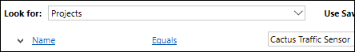
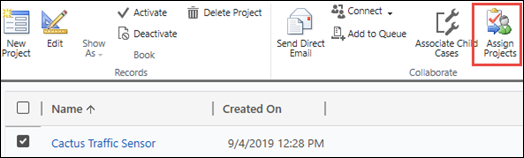
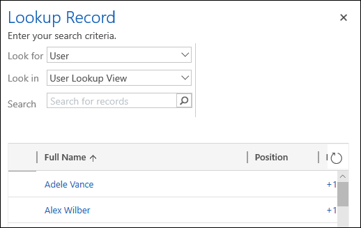

# Access a project in Project for the web after its Office 365 group has been deleted

If the Office 365 group that is associated with your project has been deleted, users in the group won’t be able to access the project.  However, there are ways for you to regain access.

- The group owner can restore the Office 365 group.
- An admin can reassign the project to a user who can then choose or create a new group.

The option you should choose depends on how long ago the group was deleted.

## Restore the Office 365 group

If a group that you own has been deleted, it will be retained for 30 days by default. This 30-day period is considered a "soft-delete" because you can still restore the deleted group. After 30 days, the group will be permanently deleted and can’t be restored.

If you’re the owner of an Office 365 group, you can restore the group yourself by following these steps.

1. On the [**Deleted groups page**](https://outlook.office.com/people/group/deleted), select the **Manage groups** option under the **Groups** node, and then choose **Deleted**.
2. Select on the **Restore** tab next to the group you want to restore.

After you've restored the group, members of the group should be able to access the associated project in Project for the web.

> [!Note]
> To learn more about deleting an Office 365 group, see [Restore a deleted Office 365 Group](/office365/admin/create-groups/restore-deleted-group)

## Reassign the project

If the Office 365 group has been deleted for longer than 30 days, it isn’t restorable and an admin in your tenant will need to  reassigning the project to either the user who needs to access it or someone who can add a new Office 365 group in Project for the web.

The admin will need to:

1. Find the project through the Advanced Find search function in the Dynamics 365 Admin Center.
2. Assign the project to the user that needs to access it. 

### Find the project in Advanced Find search

Use [Dynamics 365 Advanced Find search](/dynamics365/customer-engagement/basics/save-advanced-find-search) to look for the project you need.

1. In the Dynamics 365 Administration Center, select the default instance, and then select **Open**.
2. On the PowerApps Settings page, select **Dynamics 365 Custom**.
3. On the **Projects** page, select the filter icon in the menu bar and then select **Advance Find**.

    
4. In Advanced Find, in the **Look for** menu, select **Projects**.  In the **Use Saved View** menu, select **All projects**.
5. Select **Select**, and from the menu, select **Name**.  From the next menu, select **Equals**, and then in the **Enter text** box type the name of the project you’re looking for.  

     

6. Select **Results** to run the query. The project you’re looking for should display in the Projects tab.

### Reassign the project to a new user

After locating the project through Advanced Find, the admin can now reassign the project to a user.

To reassign a project to a user:

1. Select the checkbox next to the project name.
2. In the ribbon, select **Assign Projects**. 

     
3. On the **Assign Project** screen, select in the **Assign to** box to change it to **User or team**.
4. Select in the **User or team** box, and then select the magnifying glass icon. Then scroll to the bottom of the results and select **Look up more records**.
5. On the **Lookup Record** screen, select **User** in the **Look for** menu, select the user from the user list, and then select **Add**.

     

The user that you added will now be able to access the project in Project for the web. The user can also choose to associate a new Office 365 group with the project and add users to it if others also need to access the project.

## See Also

[Share a project in Project for the web](https://support.office.com/article/share-a-project-in-project-for-the-web-885758f0-c216-4129-a53d-6e2406977469?ui=en-US&rs=en-US&ad=US)  
