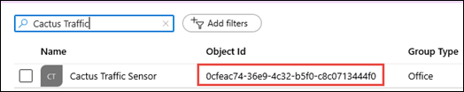

# Access a project in Project for the web after the Office 365 group has been deleted

If the Office 365 group that you are sharing your Project for the web project with is deleted, users in the group will not be able to access the project.  However, there are ways for you to regain access.

## Restore the Office 365 group

If you've deleted a group that you own, it will be retained for 30 days by default. This 30-day period is considered a "soft-delete" because you can still restore the deleted group. After 30 days, the group and its associated contents are permanently deleted and cannot be restored.

If you are the owner of an Office 365 group, you can restore the group yourself by following these steps.

1. On the [**Deleted groups** page](https://outlook.office.com/people/group/deleted), select the **Manage groups** option under the **Groups** node, and then choose **Deleted**.
2. Click on the **Restore** tab next to the group you want to restore.

After you've restored the group, members of the group should be able to access the associated project in Project for the web.

> [!Note]
> To learn more about deleting an Office 365 group, see [Restore a deleted Office 365 Group](https://docs.microsoft.com/office365/admin/create-groups/restore-deleted-group?view=o365-worldwide)

## Connect a new Office 365 group to the project

If the Office 365 group has been deleted for longer than 30 days, you will need an admin in your tenant to help you with connecting a new Office 365 group to the project.

First, the user that wants to access the project will need to [create a new Office 365 group](https://support.office.com/article/create-a-group-in-outlook-04d0c9cf-6864-423c-a380-4fa858f27102) to provide to the admin. This group will be substituted for the group that was deleted, and will give the group owner access to the project.

There are many way to create a group, but the most common way is to [create it through Outlook](https://support.office.com/article/create-a-group-in-outlook-04d0c9cf-6864-423c-a380-4fa858f27102#ID0EACAAA=Windows).

After the user creates a new group, an admin will need to:
1. Find the Office 365 group's AAD ID value for the group you created.
2. Find the project through the Advanced Find search function in the Dynamics 365 Admin Center.
3. Edit the project to substitute the new Office 365 group's AAD ID for the old value (the Office 365 group that was deleted). 

### Find the Office 365 group's AAD ID value

You first need to find the Azure AD Object ID of the new group that you plan to share the project to. You can get this by checking the group's properties in Azure Active Directory or by using [Get-AzureADGroup](https://docs.microsoft.com/powershell/module/azuread/get-azureadgroup?view=azureadps-2.0).

To find an Office 365 group's Azure AD Object ID in the Azure Active Directory Admin Center:
1. In the Azure Active Directory Admin Center, click on **Groups** to see a list of all groups in your organization.
2. If you cannot readily see the group you are looking for, use the search box to find it.
3. After locating the group you are looking for, you can find the group's Office 365 group's AAD ID value under the **Object Id** column.

### Add the new Office 365 group's AAD ID value to the project

## See Also
  
  

