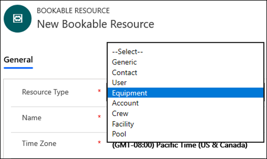

# Add non-user resources in Project for the web

Project for the web is built on the [Microsoft Power Platform](https://powerplatform.microsoft.com/en-us/), and some aspects of resource setup for Project for the web is done in Dynamics 365, such as how to add resources that are not users in your organization (for example, contacts or equipment) and making them available to assign to tasks.

While users in Azure Active Directory (AAD) are available to assign to project tasks in Project for the web, you need to manually add non-user resources.

> [!Note] 
> Guest users accounts in AAD are not  supported to be available to directly assign  to tasks in Project for the web.

## Types of non-user resources

Some of the more commonly used non-user resources you will be able to add include:

|||
|:-----|:-----|
|**Name**   |**Description**   |
|Contact or Account     |The resource is not directly a part of your organization, but needs to be scheduled. A common example is subcontractors.    |
|Equipment   |The resource is a piece of equipment, tool, or machine that must be scheduled.    |

> [!Note] 
> You will only be able to assign user, contact, account, or equipment resource types to project tasks in Project for the web.

For more information about non-user resources, see [Set up a bookable resource](https://docs.microsoft.com/dynamics365/field-service/set-up-bookable-resources#add-work-hours). 

## Create a non-user resource

You first need to go to the Dynamics 365 Project Resources page:
1. While logged into Office 365, open a browser window and go to **https://<spam><spam>web.powerapps<spam><spam>.com**.
2. On the PowerApps page, select **Apps**.
3. On the Apps page, in the Org Apps tab, select **Project**.
4. On the Project page, in the left pane, select **Resources**.

When you get to the resources page, do the following:
1. On the Resources page, click **New**.
2. On the New Bookable Resource page, click in the **Resource Type** field, and select the resource type you need to create.

3. Provide the information needed for the resource type you selected.
4. In the **Name** field, type the name your want to give the resource.
6. When you’re done, click **Save and Close**.

The new resource will display in the Bookable Resources page and can be assigned to tasks in Project for the web.

 
## See Also

[Set up a bookable resource](https://docs.microsoft.com/dynamics365/field-service/set-up-bookable-resources#add-work-hours)
  
  

