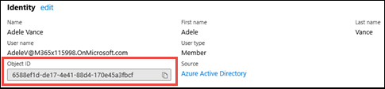
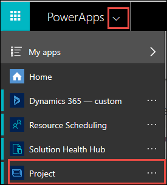

# Delete user data from Project for the web

To delete user data from Project for the web, you need the user's Azure AD Object ID. You can get this by checking the user's profile properties in Azure AD or by using [Get-AzureADUser](/powershell/module/azuread/get-azureaduser).

To find a user's Azure AD Object ID in the Azure AD Admin Center:

1. In the Azure Active Directory Admin Center, select **Users** to see a list of all users in your organization.
2. From the list of all users in your organization, select the name of the user.
3. On the user profile page, in the **Identity** section, you can find the user's Azure AD Object ID value in the **Object ID** field. 

## To find and delete a user's roadmaps

1. In the [Microsoft 365 admin center](https://admin.microsoft.com), under **Admin centers**, select **Dynamics 365**.
2. In the Dynamics 365 Administration Center, select the default instance, and then choose **Open**.
3. On the PowerApps page, select the Settings icon in the menu bar, and select **Advanced Settings**.
4. On the **Dynamics 365 Settings Business Management** page, select the filter icon and then select **Advanced Find**.
5. From the **Look for** menu, choose **Roadmaps** followed by **Edit Columns** and **Add Columns**.
6. Choose the columns that you want to search on. Be sure to include **Office 365 Group AAD ID**.

   |**Display name**|**Description**|
   |:---------------|:--------------|
   |Name|Name of the roadmap.|
   |Order Hint|Ordering of the roadmap rows within a roadmap.|
   |Owner Azure AD ID|ID of the user in Azure AD who owns the roadmap.|
   |Parent Roadmap|ID of the parent roadmap.|
   |Creator Azure AD ID|ID of the user in Azure AD who created the roadmap.|
   |Office 365 Group Azure AD ID|ID of the roadmap's Office 365 group in Azure AD.|
   |Roadmap|Unique identifier of a roadmap.|
   |Roadmap Type|The type of roadmap record.|

7. Select **OK**, and then select **OK** again.
8. In the **Fields** list, choose **Owner AAD Id** and type in the user's Azure AD Object ID.
9. Select **Results**.
10. Select the name of the roadmap you want to delete.
11. Select **Delete**.

## To make changes to a user's roadmap

From your Advanced Find search results, make note of the Office 365 Group Azure AD ID for any roadmap that you want to make changes to. You must join this group as an owner in order to make updates to the roadmap.

To add yourself as a group owner, use [Add-AzureADGroupOwner](/powershell/module/azuread/add-azureadgroupowner):

`Add-AzureADGroupOwner -ObjectId <GroupID> -RefObjectId <YourAADObjectID>`

For example,

`Add-AzureADGroupOwner -ObjectId "62438306-7c37-4638-a72d-0ee8d9217680" -RefObjectId "0a1068c0-dbb6-4537-9db3-b48f3e31dd76"`

Once you’re an owner for the groups, you can open the roadmaps from Project Home and make edits directly. Roadmap must be enabled to do this.)

### For roadmaps not associated to an Office 365 group

If your user's roadmap isn’t associated to an Office 365 group, and you want to be able to make edits to it, you need to add a group that you own to the roadmap.

This first requires you to create an Office 365 Group and get the Office 365 Group Azure AD ID value for it. After you do this, perform the following steps:

1. In the Advanced Find search results, select the name of the roadmap to open it in Dynamics 365.
2. In the Roadmap Information page in Dynamics 365, select the menu item with three dots, and in the menu select **Flow**, and then select **Form Editor**.
3. In the **Form Editor**, select **Office 365 Group AAD id** from the Unused Fields list, and drag and drop it to the **General** section of the form, under Owner.
4. After filling in the information in **Form Editor**, select **Save** and then **Publish**.
5. After the change in completed, on the Roadmap Information page, you’ll see the Office 365 Group Azure AD ID field display. Enter the Office 365 Group Azure AD ID value of the group you own into the field box.

You’re now the owner of the Office 365 Group for the roadmap and can edit it.

## To find a user's projects

1. In the [Microsoft 365 admin center](https://admin.microsoft.com), under **Admin centers**, select **Dynamics 365**.
2. In the Dynamics 365 Administration Center, choose the default instance, and then select **Open**.
3. Select **Advanced Find**.
4. From the **Look for** menu, choose **Projects**.
5. To begin building your query, choose **Select**, and then select the fields you need to start searching for projects your user was a part of. You’ll need the users Azure AD ID or account name.  For example:
    - To find all projects owned by the user, select the Owner field, and then select Equals, and then enter the account name for the user.
    - To find all projects created by the user, select the Created By field, and then select Equals, and then enter the account name for the user.

6. After you’ve selected your search criteria, in the ribbon, select **Edit Columns**.
7. On the Edit columns page, select **Add columns**, and then select the columns you want to include in the query. When done, select **OK**.
8. Select **Results** to run your query.

### To delete or edit a project

To delete or edit a user's project, perform the following steps:

1. From the Advanced Find search results list, note the project you want to delete or update.
2. On the PowerApps admin page, select the drop-down menu and select **Project**. 

3. On the Project page, in the **System Views** menu, select **All Projects**.
4. Choose the project you’re interested in deleted or redacting.
5. On the project page, you can choose:
    - **Delete** to delete the project.
    - **Tasks** to update the project's tasks.

## To delete or edit Task History for a project
Users can delete all history records for a project by deleting the project.

To selectively remove history records, perform the following steps.  

1. Sign in to [Power Apps](https://make.powerapps.com) and select the appropriate Dataverse environment. For most users, this will be the **default** environment. 
2. Navigate to **solutions > Project**. The **Name** property for this table is **msdyn_ProjectServiceCore_Patch**. 
3. Locate and select the **Project History** table. 
4. Click the **Edit** option for the table. 
5. Select the records you want to delete and click **Delete n records**

## See Also

[Create, edit, or save an Advanced Find search](/dynamics365/customer-engagement/basics/save-advanced-find-search)

[Export user data from Project for the web](export-user-data-from-project-for-the-web.md)

[Delete user data from Project Online](/projectonline/delete-user-data-from-project-online)
