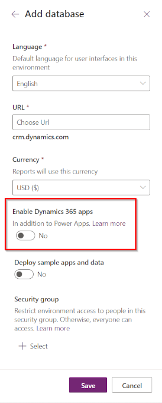
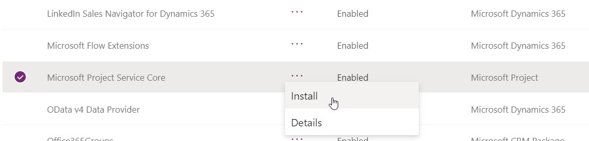

# Deploying Project

> [!Note]
> This section refers to upcoming functionality. Project can only be deployed to the default Dataverse instance. It is not yet possible to deploy Project to other types of Dataverse instances.

Project for the web is available for use in the Default Environment as well as in Sandbox and Production Dataverse environments.

Project for the web in the Default environment enables customers to quickly get started creating projects, managing schedules, and sharing them with other users in the organization. Because everyone is a member of this environment by default, enabling users to create and manage Projects only requires that you assign a Project license to them.

For some situations, you should consider deploying Project to additional environments. These are:
* Application Lifecycle management (Development/Test/Production)
* Data residency requirements for when the tenant is in a different geography than the users
* Customizing Project to behave differently for different business units

If you are looking to deploy to additional environments, you will need to create the environments, deploy Project, and configure access for users.

[Learn more about Dataverse environments](https://docs.microsoft.com/power-platform/admin/environments-overview)

## Provisioning a new environment
> [!Note]
> This section only applies to Admins interested in deploying Project to a non-Default environment.

Project is supported in the following types of environments
* Default
* Production
* Sandbox

To be able to deploy to Sandbox and Production environments, the environment needs to be created with a database and the "Enable Dynamics 365 Apps" toggle *must* be disabled.

  

[Learn more about creating and managing environments](https://docs.microsoft.com/power-platform/admin/create-environment)

## Deploying Project for the web

### Deploying to the Default environment

Deployment of Project to the Default environment is done for you automatically. When Project for the web or Roadmap are first used in an Office 365 tenant, a Default Dataverse instance is provisioned for the tenant and the solutions are deployed.

### Deploying to a non-Default environment
Deploying Project to a non-Default environment is done from within the [Power Platform Admin Center (PPAC)](https://admin.powerplatform.microsoft.com). 

Open the **Resources > Dynamics 365 apps** page from the left-hand navigation menu. Then, install the **Project Service Core** package into your environment.
 

> [!Note]
> If the installation package isn't appearing in the list of available packages, either the tenant doesn't have a Project license, or the environment was created with the "Enable Dynamics 365 Apps toggle" enabled. 

[Learn more about using the PPAC to deploy applications](https://docs.microsoft.com/power-platform/admin/manage-apps)

## Configuring Roles and Security

Sandbox and Production environments require additional configuration. Assign the **Project Common** and **Project User** roles to anyone who will be creating Projects in the environment. Also, ensure these users have the appropriate Project license.

There is no additional configuration needed to enable users to manage Projects in the Default environment. Users in the Default environment only need a Project license to be able to create and manage Projects. 

[Learn more about security roles in the Dataverse](https://docs.microsoft.com/power-platform/admin/security-roles-privileges)

> [!Note]
> Project-related roles are only available after the Project Service Core package has been deployed to the environment.

## Creating and managing projects in non-Default environments

In non-Default environments, projects are created and managed via the Project Power App. Users with the Project User and Project Common roles will see the Project app tile appear in [Dynamics Home](https://home.dynamics.com).
