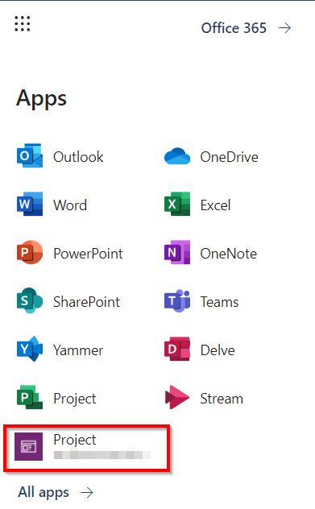

# Frequently Asked Questions
## Using Project

### Does Project for the web include a way to record timesheets?

No. If this is something that you need, let us know at the [Project for the web User Voice site](https://microsoftproject.uservoice.com/forums/914203-project-for-the-web)!

### Why is the Tasks tab in the Project Power App blank?
This may be happening because third-party cookies are disabled for your web browser. In your browser settings, choose to allow ‘third-party cookies’.
### What is the Project Power App?
The Project Power App can be used by you and your organization to completely customize Project for your workflows and processes. It is automatically deployed to the Default Dataverse environment the first time you open Project.
### How can I reach the Project Power App?
You can find the Project Power App in the [Microsoft 365 app launcher](https://support.microsoft.com/office/meet-the-microsoft-365-app-launcher-79f12104-6fed-442f-96a0-eb089a3f476a). Just look for the Project app with the purple icon.

 

## Customization
### Can I customize the Project Power App?
Yes! It is a [model-driven Power App](https://docs.microsoft.com/powerapps/maker/model-driven-apps/model-driven-app-overview), which means you [use the Power Apps designer](https://docs.microsoft.com/powerapps/maker/model-driven-apps/model-driven-app-overview) to edit the look and feel of Project.

### How can I add custom fields at the Project level?
[Use the Power Apps designer](https://docs.microsoft.com/powerapps/maker/model-driven-apps/model-driven-app-overview) to add columns to the Tables, Views, and Forms in the Project Power App.

### I need to use more than five custom tables with Project for the web, how can I do that? 
Create a new Power App and add any tables you need into it. You can have all the core Project tables, views, and forms, as well as any additional custom tables that you need. Users of this new Power App will need at least a Project Plan 3 or Plan 5 license, as well as a license to PowerApps. If you intend to use tables from other applications, be sure to follow any licensing guidelines for those apps. 

### How can I change the access rights for users of Project data in the Dataverse?
The Project Team Member role is customizable and can be used to manage the access rights of users. Learn how to customize roles [here](https://docs.microsoft.com/power-platform/admin/wp-security-cds#:~:text=Dataverse%20uses%20role%2Dbased%20security,Dataverse%20teams%20and%20business%20units.).

### How can I use Power BI with Project for the web?
You can use the [Project for the Web Power BI content pack](https://github.com/OfficeDev/Project-Power-BI-Templates/tree/master/Project%20for%20the%20Web) to create reports on Project for the Web data. Users will need the appropriate license to be able to view these reports. Refer to other guidance in this FAQ, as well as in the [Microsoft Project service description](https://docs.microsoft.com/office365/servicedescriptions/project-online-service-description/project-online-service-description).

### Can I build apps or reports that include local custom fields?
No. Local custom fields are stored in a binary format within Project tables in Dataverse. These fields are not available for reporting. 

### Can I remove a resource from the Project Team Dataverse table?
You can manage the team from within Project. But, you cannot manage resources directly in the table in Dataverse.

### Can I open the Project tables in Excel and edit them using the Dynamics widget?
You can open the Dataverse tables in Excel. However, fields included in Project cannot be directly written to. Netiher can you create new rows in many of the tables. However, custom columns that you have added to the tables *can* be directly edited within Excel.

### Can I deploy to a Dataverse environment where I have other Dynamics 365 applications?
Project can be deployed to Dataverse environments that have the “Enable D365 Apps” toggle disabled. This means Project for the web cannot be deployed in environments that contains applications such as Dynamics 365 Sales or Project Operations. Learn more about deploying Project for the web [here](deploying-project.md).

## Licensing

### Can I build a standalone Power App and include Project tables in it?
Yes, you can. All users of this Power App will need a Project Plan 3 license as well as a Power Apps license.

### Is Power BI included?
The [Project for the Web Power BI content pack](https://github.com/OfficeDev/Project-Power-BI-Templates/tree/master/Project%20for%20the%20Web) is free to download. However, users will need a Project Plan 3 license as well as a Power BI license to build or view reports.

### Can embedded canvas apps in model-driven apps be used with a Project Plan license?
No. Users will need a separate Power Apps license to embed canvas apps into the Project Power App. 

### There are several additional tables included in the Project solution that aren't visible in the Power App, can I use them?. 
You can use many of the tables in the Project Solution to customize the look and feel of Project for your users. These additional tables are:

- msdyn_projectchange
- msdyn_projectprogram
- msdyn_projectrequest
- msdyn_projectrisk
- msdyn_projectissue
- msdyn_projectstatusreport

### How many Dataverse environments can I provision with a Project license?
The number of environments you can provision depends on the number of licenses you have. At the minimum, you need one Project license to deploy Project in the Default Environment, and at least five Project licenses to deploy to Production environments. Additional environments can be provisioned depending upon the amount of Dataverse database storage you have. Details about the storage included with Project licenses are in the [Microsoft Project service description](https://docs.microsoft.com/office365/servicedescriptions/project-online-service-description/project-online-service-description).
