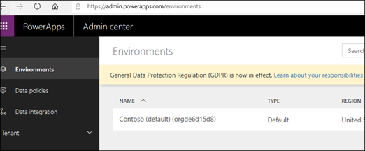

# Handling data for Project

This article gives you an overview of how data is handled for two Project services: Project for the web and Project Online. 

Project Online is built on SharePoint Online and its data is stored in Office 365 (specifically in SharePoint Online).

Project for the web is built on the [Microsoft Power Platform](https://powerplatform.microsoft.com/). Project for the web data is stored in [Dataverse](https://docs.microsoft.com/powerapps/maker/common-data-service/data-platform-intro).

> [!Note] 
> Project for the web data also includes data from its Roadmap feature. 

## Data retention

Since Project for the web data is stored in CDS, data retention policies differ from Project Online (whose data is stored in Office 365).  When your Project Online subscription ends, your data is retained for 90 days before it is automatically deleted (in accordance to [Office 365 data retention policies](https://docs.microsoft.com/microsoft-365/compliance/retention-policies)).  However, if you use Project for the web (which is included in Project Plan 1, Project Plan 3, and Project Plan 5 licenses), that data is not automatically deleted 90 days after your subscription ends. 

You can remove all Project for the web or Roadmap data by [removing the entire solution from from Microsoft 365](https://docs.microsoft.com/project-for-the-web/remove-roadmap-from-office-365).

## Where is my data located

You can look for the location of where your Project for the web and Project Online data is stored by seeing [Explore where Office 365 stores your customer data](https://products.office.com/where-is-your-data-located?rtc=1). 

### Project for the web and Dataverse

When Project for the web is first used in your Microsoft 365 tenant, a default Dataverse instance is provided to your tenant.  Project for the web data (such as projects or roadmaps) is stored in solutions in the default instance.

Admins can find the name and details of their default Dataverse instance in the PowerApps admin center (admin.powerapps.com).  

### Deleting user data

If you need to delete Project for the web data (for example, you need to delete data for a specific user) an admin can choose to [manually delete](delete-user-data-from-project-for-the-web.md) it.

Similarly, an admin can also [manually delete Project Online data](https://docs.microsoft.com/projectonline/delete-user-data-from-project-online) (for example, user data or user identifying data) if needed.

## Turn off Project for the web

An admin can choose to either [turn off Project for the web to your organization](https://docs.microsoft.com/project-for-the-web/turn-project-for-the-web-off#turn-project-for-the-web-on-or-off-for-all-users-in-your-organization) or choose to [turn off Project for the web to specific users in their organization](https://docs.microsoft.com/project-for-the-web/turn-project-for-the-web-off#turn-off-project-for-the-web-for-specific-users-in-your-organization). 

 > [!Note] 
 > When you turn off Project for the web to individual users in your tenant, you will also turn off the Roadmap feature for those users.

## Turn off Roadmap 

Although Roadmap is a Project for the web feature, it is possible that some organizations may want to use Roadmap, but may want their users to access Project for the web at a later time.

The **Turn Roadmap on for your organization** control on the Project Settings page allows you to [turn Roadmap on or off in your organization](https://docs.microsoft.com/project-for-the-web/turn-roadmap-on-or-off).  
 

## Turn off Project Online

An admin may want certain users to have access to Project for the web and the Roadmap feature, and not Project Online. To do this, an admin would need to [turn off the Project Online service for the user](https://docs.microsoft.com/project-for-the-web/turn-project-for-the-web-off#turn-off-project-online) through their assigned Project Plan 3 or Project Plan 5 license.

## See Also
  

[Project for web get started guide for admins](project-for-the-web-get-started-guide-for-admins.md)

