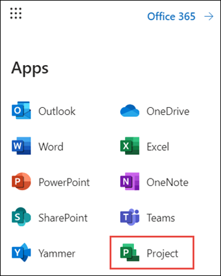

# Remove Project from the Office 365 App Launcher


If you have users with one of the [Microsoft 365 or Office 365 licenses that allows them to view Project for the web projects and roadmaps](https://docs.microsoft.com/project-for-the-web/office-365-user-view-access-to-project-and-roadmap#office-365-subscription-with-view-access), a Project tile will display in the Office 365 App Launcher.  



An admin may want to keep the Project tile from displaying for the user in some situations, such as: 

- When the user does not have a Project license and does not care to view Project for the web projects or roadmaps. 
- When the user has a Project license, but doesn't use Project for the web or Roadmap. 

To remove the Project tile from the App Launcher for a user, an admin needs to remove the **Project for Office** service for the user’s Microsoft 365 or Office 365 license in the Microsoft 365 admin center. 

> [!NOTE]
> If you had previously disabled the **Common Data Service for Project** service to hide the Project tile, please enable it and use the steps in this article to disable the new **Project for Office** service.  Future Office scenarios in addition to Project will depend on CDS.

> [!Important] 
> Removing the Project for Office service will not only remove the Project tile, but will also no longer allow the user to view Project for the web projects and roadmaps. 


### To remove the Project tile for an individual user 

1. In the Microsoft 365 Admin Center, select **Users**, then select **Active Users**. 
2. From the **Active users** list, select the checkbox next to the user, and then click **Manage product licenses**. 


3. On the user information page, select the **licenses and apps** tab, in the **Apps** section, select the user's Microsoft 365 or Office 365 license from the **Show apps for** drop down menu.  
4. In the list of apps that display, uncheck **Project for Office**, and then click **Save changes**. 

 You can repeat this procedure for each user that you don't want to use Project for the web. 

### To remove the Project tile for multiple users

If you need to remove the Project tile for a large number of users, it may be easier for an admin to do this through Windows PowerShell instead of through the Microsoft 365 admin center. 

Make sure to use the latest [Azure Active Directory module](https://docs.microsoft.com/office365/enterprise/powershell/connect-to-office-365-powershell).

> [!Important] 
> Again, note that removing the Project for Office service will not only remove the Project tile, but will also no longer allow the user to view Project for the web projects and roadmaps. 


1. In Windows PowerShell, type and enter the following to sign into your tenant.</br>
```PowerShell
Connect-AzureAd
```
2. After connecting to Azure Active Directory, you can use the following to get a list of the Office 365 or Microsoft 365 licenses that have view access to Project for the web and Roadmap on your tenant. 
```PowerShell

$returnObject = @()
Get-AzureADSubscribedSku | % {
    $cds = $_.ServicePLans | ? ServicePlanName -in ("PROJECT_O365_F3","PROJECT_O365_P1","PROJECT_O365_P2","PROJECT_O365_P3")
    
    if( $cds -ne $null ) 
    {
        $returnObject+= [pscustomobject]@{SkuId=$_.SkuId;SkuPartNumber=$_.SkuPartNumber;ServicePlan=$CDS[0].ServicePlanName}
    } 
}
if ($returnObject.Count -eq 0) {
        Write-Host "No Skus found"
    } else {
        $returnObject
}

```


3. You can use the following script to help you to disable the Project for Office service plan for specific users and their associated license. For each user, you will need to know to know the **$skuPart** value for their license (you can find this in the results of step 2). </br>
```PowerShell
#disable the plan for the user/sku combination

$user = "<user>@tenant.onmicrosoft.com"  #user
$skuPart = "ENTERPRISEPREMIUM"   #sku to disable the plan on from the previous step

$plansToDisableList = @("PROJECT_O365_F3","PROJECT_O365_P1","PROJECT_O365_P2","PROJECT_O365_P3")

#Get the SKU details
$sku = Get-AzureADSubscribedSku | Where {$_.SkuPartNumber -eq  $skuPart}

#Get a reference to the service plan we are disabling
$newPlansToDisable = $sku.ServicePlans | ? {$_.ServicePlanName -in $plansToDisableList}


#Get any disabled service plans (apps) on the SKU assigned to the user
$existingDisabled =Get-AzureADUserLicenseDetail  -ObjectId $user  | ? {$_.SkuPartNumber -eq  $skuPart } | Select-Object -ExpandProperty  ServicePlans |  ? {$_.ProvisioningStatus -eq 'Disabled' }

#Merge the lists together so we are maintaining disabled service plans (apps)
$totalDisabledPlans = @($newPlansToDisable,$existingDisabled)

#Create a license with the service plan (apps) disabled
$license = New-Object -TypeName Microsoft.Open.AzureAD.Model.AssignedLicense
$license.SkuId = $sku.SkuId
$license.DisabledPlans = $totalDisabledPlans.ServicePlanId


$licenses = New-Object -TypeName Microsoft.Open.AzureAD.Model.AssignedLicenses
$licenses.AddLicenses = $license

#Assign updated SKU
Set-AzureADUserLicense -ObjectId $user -AssignedLicenses $licenses


```


## See Also
[Office 365 user view access to Project and Roadmap](office-365-user-view-access-to-project-and-roadmap.md)  
[Project architecture overview](project-architecture-overview.md)</br>
[Office 365 platform service description](https://docs.microsoft.com/office365/servicedescriptions/office-365-platform-service-description/office-365-platform-service-description)


