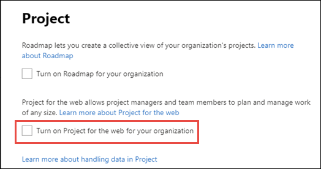
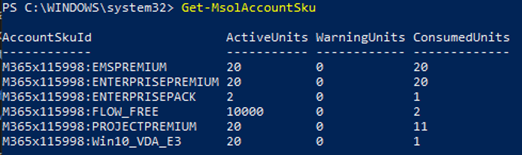
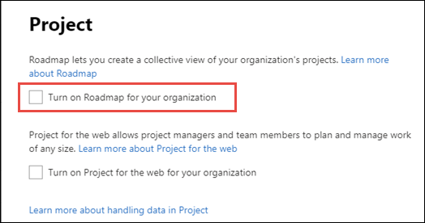

# Turn Project for the web or Roadmap on or off for users in your organization

> [!VIDEO https://www.microsoft.com/videoplayer/embed/RE4xoa0]  

Access to Project for the web is available to users if they’re assigned one of the following licenses:

- Project Plan 1
- Project Plan 3 (previously called Project Online Professional)
- Project Plan 5 (previously called Project Online Premium)

Users who have Project Plan 3 and Project Plan 5 licenses have access to not only Project Online and the Project Online Desktop Client, but also Project for the web and Roadmap. 

> [!Note]
> Users only have read-only access to Roadmap through the Project Plan 1 license.

## How admins can control access to Project for the web and Roadmap

An Office 365 admin may want to control user access to Project for the web or Roadmap in their Office 365 tenant for various reasons. For example:

- An admin may want to turn on Project for the web for the organization, but turn it off for some users who currently work exclusively in Project Online.

- An admin may want to turn off Project for the web temporarily to all users so that they can roll it out gradually.

- The admin may want to turn the Roadmap feature on to all users in the tenant, even if Project for the web is turned off.

- The admin may want to only provide Project for the web and Roadmap to specific users, and doesn’t want to give them access to Project Online.

This article describes how admins can do the following to address similar scenarios:

- [Turn Project for the web on or off for all users](#turn-project-for-the-web-on-or-off-for-all-users-in-your-organization)
- [Turn Project for the web on or off only for specific users](#turn-off-project-for-the-web-for-specific-users-in-your-organization)
- [Turn the Roadmap feature on or off to all users](#turn-roadmap-on-or-off)
- [Turn off Project Online to specific users](#turn-project-online-off)

## Turn Project for the web on or off for all users in your organization

An admin can turn Project for the web on or off for all users in their organization through the Project settings page in the Microsoft 365 admin center.

> [!Important]
> This setting is only available in the [new Microsoft 365 admin center](/microsoft-365/admin/microsoft-365-admin-center-preview). If you are using the classic admin center, you will need to switch to the new Microsoft 365 admin center to access this setting.</br>

To turn on or off Project for the web:

1. In the Microsoft 365 admin center, expand the navigation menu, select **Settings**, and then select **Org Settings**.
2. Select **Project**.
3. On the **Project** settings page, select or deselect **Turn on Project for the web for your organization**, and then select **Save changes**.



If an admin tries to access the Project settings page and receives the error message *Unable to retrieve settings*, have a licensed user go to their Project Home page (project.microsoft.com). This will initiate Project for the web on the tenant and will make the Project settings available for the admin.

> [!Important]
> Currently, if you turn on Project for the web, actual activation on your tenant will happen at a later date (for more information, see your Message Center). </br> 

> [!Important]
> Turning Project for the web on or off will have no effect on your ability to use Project Online. </br>

### Project for the web isn’t turned on for your organization

If your licensed users were previously able to use Project for the web, but are no longer able to, you can resolve this by turning on Project for the web in the steps described earlier.

The problem will appear as:

- Your users will no longer see the **New blank project** option on the Project Home page.
- When opening a project, users will see the error **Project is not turned on for your organization**.

## Turn off Project for the web for specific users in your organization

 An admin can manage access to Project for the web for specific users by turning off the service for their associated Project Plan licenses. This assumes that that Project for the web is turned on for the organization in the Project settings page in the Microsoft 365 admin center.

 If you want to turn off Project for the web for specific users in your organization, an admin can do this by turning off the **Project P3** service for the user in the Microsoft 365 admin center.  

You might want to do this if your users currently use Project Online (through Project Plan P3 or Project Plan P5 licenses) and you don't want to give all of your users access to Project for the web at the moment.

> [!NOTE]
> Turning off Project for the web for the individual user will also turn off the Roadmap feature for them, even if the Roadmap admin setting is turned on.

To turn off Project for the web for a user:

1. In the Microsoft 365 admin center, select **Users**, then choose **Active Users**.
2. From the **Active users** list, select the checkbox next to the user, and then choose **Manage product licenses**.</br>

3.  On the user information page, select the **licenses and app** tab, in the **Apps** section,  select the user's Project Online license from the **Show apps for** drop-down menu. This would be either Project Online Professional or Project Online Premium.
4. In the list of apps that display, uncheck **Project P3**, and then choose **Save changes**.</br>

     

    You can repeat this procedure for each user that you don't want to use Project for the web.

> [!Important]
> The service plan that disables Project for the web is called **Project P3**.  It is important to distinguish it from **Project Plan 3**, which is one of the three licenses in which Project for the web is available. Project Plan 1, Project Plan 3, and Project Plan 5 are all licenses that have the Project P3 service plan.</br>  


### Turn Project for the web off for multiple users using Windows PowerShell

If you need to turn off Project for the web for a large number of users, it may be easier for an admin to do this through Windows PowerShell instead of through the Microsoft 365 admin center.

> [!Note]
> Before attempting this, you first need to [install the required modules](/office365/enterprise/powershell/connect-to-office-365-powershell#connect-with-the-microsoft-azure-active-directory-module-for-windows-powershell) and be a global admin on your tenant. </br>
> Also, when you open Windows PowerShell, make sure to run as an administrator. 


1. In Windows PowerShell, type and enter the following to sign into your tenant.</br>
```PowerShell
Connect-MsolService
```
2. Type the following to find the **AccountSkuId** of your Project Online licenses.</br>
```PowerShell
Get-MsolAccountSku
```
You should see a list of the licenses available on your tenant, for example:
 </br>
3. Look for the accountSKUid values that contain **PROJECTPREMIUM** or **PROJECTPROFESSIONAL**.
   - PROJECTPREMIUM is Project Plan 5 (Project Online Premium)
   - PROJECTPROFESSIONAL is Project Plan 3 (Project Online Professional)

        The value will be prefixed by the tenant domain name. For example, in the previous image, the AccountSKUID value for the Project Online Premium license is **M365x115998:PROJECTPREMIUM**.</br>

4. Create a $LicenseOption object that disables the Project P3 service plan (PROJECT_PROFESSIONAL) from the Project Plan 3 and Project Plan 5 licenses (the AccountSKUID values). </br>In our example, the following cmdlet will disable the Project P3 service plan in a Project Plan 5 license.</br>
```PowerShell
$LicenseOptionsPremium = New-MsolLicenseOptions -AccountSkuId "M365x115998:PROJECTPREMIUM" -DisabledPlans "PROJECT_PROFESSIONAL"
```
If the tenant had Project Plan P3 licenses (Project Online Professional), the following cmdlet will disable it in that license. </br>
```PowerShell
$LicenseOptionsProfessional = New-MsolLicenseOptions -AccountSkuId "M365x115998:PROJECTPROFESSIONAL" -DisabledPlans "PROJECT_PROFESSIONAL"
```
5. After you've created the objects, create a list of your user accounts in which you'd like to disable Project for the web.  There are different ways to do this, such as importing from a CSV file.  For our example, we'll create a UPNList with the user accounts in which we want to disable Project for the web.</br>
```PowerShell
`$UPNList = @("AdeleV@M365x115998.OnMicrosoft.com","AlexW@M365x115998.OnMicrosoft.com")
```

6. After creating your list, apply the applicable $LicenseOption object to each user account. </br>For our example, we're applying the $LicenseOptionsPremium object to each user in the UPNList, which would disable Project for the web from each user who has a Project Plan P5 license.  </br>
```PowerShell
ForEach ($UPN in $UPNList)
{
    Set-MsolUserLicense -UserPrincipalName $UPN -LicenseOptions $LicenseOptionsPremium    
}
```
For more information about disabling services through Office 365 PowerShell, see [Disable access to services with Office 365 PowerShell](/office365/enterprise/powershell/disable-access-to-services-with-office-365-powershell). 

## Turn Roadmap on or off

An admin can do the following to turn Roadmap on or off for their organization:

1. In the Microsoft 365 admin center, expand the navigation menu, select **Settings**, and then select **Settings**.
2. Select **Project**.
3. On the **Project** settings page, select or deselect **Turn on Roadmap for your organization**, and then choose **Save changes**.
 


4. Project Roadmap may require the Project Roadmap connector to be added to a **[Data Policy](https://admin.powerplatform.microsoft.com/dlp)** in the Power Platform admin center.  At the moment, the [Project Roadmap connector doesn’t show up in the GUI of the **Data Policy**](https://github.com/MicrosoftDocs/power-platform/issues/177). 
Therefore, please follow along this guidance in order to add the Project Roadmap connector to the data group **Business** in the desired **Data Policy**.

```powershell
$userName = "<your username>"
$userPassword =  "<your userpassword>"
$DlpDisplayName = "<your desired Microsoft Purview DLP Policy DisplayName"

# Connect to PowerApps
Add-PowerAppsAccount -Username $userName -Password $userPassword

# Get all Power Platform DLP policies (Data Policies)
Get-AdminDlpPolicy

# Set desired DLP policy to be modified
$DlpPolicy = Get-AdminDlpPolicy | Where-Object DisplayName -EQ $DlpDisplayName

# Get BusinessDataGropup connectors of specific DLP Policy and check for ConnectorId '/providers/Microsoft.PowerApps/apis/shared_projectroadmap'
Get-AdminDlpPolicy -PolicyName $DlpPolicy.PolicyName | Select-Object –ExpandProperty BusinessDataGroup

# Add Connector "Project Roadmap" to BusinessDataGropup of DLP policy and check for Status 200 / Description OK
Add-CustomConnectorToPolicy -PolicyName $DlpPolicy.PolicyName -ConnectorId '/providers/Microsoft.PowerApps/apis/shared_projectroadmap' -GroupName hbi -ConnectorName "Project Roadmap" -ConnectorType "Microsoft.PowerApps/apis"

# Verify DLP policy settings
Get-AdminDlpPolicy -PolicyName $DlpPolicy.PolicyName | Select-Object –ExpandProperty BusinessDataGroup | Where-Object name -EQ "Project Roadmap"
```

### Roadmap isn’t turned on for your organization 

If your licensed users were previously able to use Roadmap, but are no longer able to, you can resolve this by turning on Roadmap in the steps described earlier.

The problem will appear as:
- Your users will no longer see the **New Roadmap** option on the Project Home page.
- When opening a roadmap, users will see the error **Roadmap is not turned on for your organization**.


## Turn Project Online off

An admin may want certain users to have access to Project for the web and the Roadmap feature, and not Project Online.  To do this, the admin wouldn’t only need to turn on Project for the web and Roadmap in Project settings, but also need to turn off the Project Online service for the user through their assigned Project Plan 3 or Project Plan 5 license.  

To turn off Project Online:

1. In the Microsoft 365 admin center, select **Users**, then select **Active Users**.
2. From the **Active users** list, select the checkbox next to the user, and then choose **Manage product licenses**.</br>

3.  On the user information page, select the **licenses and app** tab, in the **Apps** section,  select the user's Project Online license from the **Show apps for** drop-down menu. This would be either **Project Plan 3** or **Project Plan 5**.
4. In the list of apps that display, uncheck **Project Online Service**, and then choose **Save changes**.</br>
 
     

    You can repeat this procedure for each user that you want to use only Project for the web and Roadmap.

> [!Important]
> Turning Project Online on or off for a specific user will have no effect on their ability to use Project for the web. </br>

## See Also
  
  


